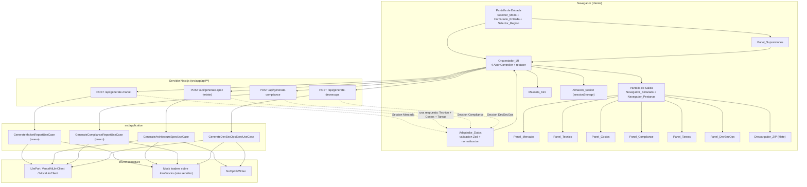
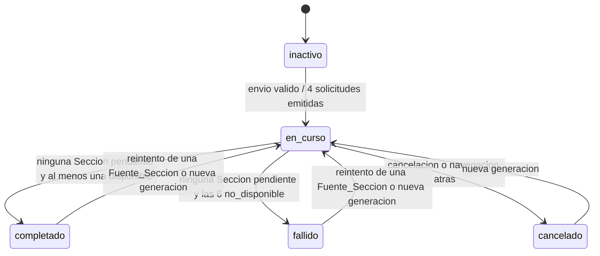

# Design Document

## Overview

Este diseño cubre el frontend completo de KiroSpec Studio y los tres endpoints HTTP que le faltan al repositorio. El frontend es una aplicación Next.js 15 App Router con React 19 que captura la Idea en dos modos, confirma las Suposiciones inferidas y presenta el Reporte dentro de un Navegador_Simulado de seis Pestañas (Mercado, Técnico, Costos, Compliance, Tareas, DevSecOps), con generación incremental: cada Sección se publica en cuanto su Fuente_Sección responde, sin esperar a las demás (Requirements 1–20). Hoy la interfaz es un placeholder de un solo `h1` en `src/app/page.tsx`, sin CSS, sin componentes y sin estado, por lo que todo lo visual se construye desde cero.

La segunda mitad del trabajo es de servidor: solo la Fuente_Sección del Agente 2 tiene manejador HTTP (`src/app/api/generate-spec/route.ts`), y esa única respuesta alimenta tres Secciones (Técnico, Costos y Tareas). Los Agentes 1 y 3 existen únicamente como prompts, sin caso de uso ni esquema Zod, y el Agente 4 tiene caso de uso (`GenerateDevSecOpsSpecUseCase`) pero solo se ejecuta por consola. El diseño añade tres manejadores bajo `src/app/api/**`, dos casos de uso nuevos en `src/application/`, dos familias de esquemas Zod nuevas en `src/domain/` y un `FileWriterPort` inerte para que ninguna petición HTTP escriba en el repositorio (Requirement 21). La arquitectura existente —Clean Architecture con puertos y adaptadores, jerarquía de errores tipada con categorías `VALIDATION | LLM_TRANSIENT | LLM_PERMANENT | FILESYSTEM` mapeadas a 400/502/500— se conserva sin cambios y se reutiliza tal cual.

## Decisiones de diseño

| # | Decisión | Elección | Razón | Alternativa rechazada |
|---|---|---|---|---|
| D1 | Estilos | **CSS Modules** (`*.module.css`) más un `src/app/globals.css` con tokens de color, tipografía, foco y breakpoints | Next 15 soporta CSS Modules sin instalar nada ni tocar la configuración de build; los estilos quedan colocados junto a su componente. Como no existe un design system, los contrastes de 4.5:1 y 3:1 y el indicador de foco visible (Requirement 18 criterios 2 y 3) se declaran una sola vez como variables CSS y se auditan en un archivo, en lugar de repetirse en cientos de clases utilitarias. | **Tailwind**: añade dependencia, PostCSS y configuración de build; sus utilidades de color no garantizan por sí solas los contrastes AA y obligan a definir de todos modos una paleta accesible. El beneficio (velocidad de prototipado) no compensa el costo en un proyecto que ya tiene `next build` verde y ninguna dependencia de estilos. |
| D2 | Estado de la generación incremental | **`useReducer` + Context** (`GeneracionProvider`), con el reducer puro en `src/application/view/generation-reducer.ts` | La máquina de estados es pequeña y cerrada: Estado_Generación con 5 valores y Estado_Sección con 3 valores por Sección (Requirement 6 criterios 13 y 14). Un reducer puro se prueba con fast-check sin DOM ni React, y las transiciones inválidas se rechazan en un único lugar. Cero dependencias nuevas. | **Zustand / Redux / Jotai**: resuelven problemas que este estado no tiene (selectores finos, middleware, devtools, estado global compartido entre rutas). Añadir una librería para 8 acciones no se justifica y complica probar el reducer aislado. |
| D3 | Renderizado de Mermaid | `mermaid` cargado con **`await import("mermaid")` dentro de un Client Component** (`DiagramaMermaid`), inicializado con `startOnLoad: false` y `securityLevel: "strict"`. El presupuesto de 3 s se aplica con `Promise.race` entre `mermaid.render()` y un temporizador; el conteo de nodos se calcula **antes** de invocar el renderizador y aborta con más de 40 nodos | Mermaid solo funciona en el navegador y pesa cientos de kB: el import dinámico lo mantiene fuera del bundle inicial y solo se descarga cuando la Pestaña Técnico se activa con un diagrama presente. `mermaid.parse()` valida la sintaxis sin dibujar, lo que permite degradar al bloque preformateado sin excepciones (Requirement 11 criterios 2, 3 y 10). El pre-conteo evita gastar el presupuesto de 3 s en un grafo que ya se sabe demasiado grande. | **Renderizar en el servidor**: Mermaid necesita DOM y medición de texto; hacerlo en el route handler obligaría a un navegador headless. **Importarlo estáticamente**: penaliza el arranque de todas las pantallas, incluida la Pantalla de Entrada, para una función que se usa en una de seis Pestañas. |
| D4 | Generación del ZIP | **`fflate`** (`zip` asíncrono), cargado con `await import("fflate")` al activar el Descargador_ZIP | ≈8 kB minificados y sin dependencias, frente a ≈95 kB de JSZip; expone `zip()` asíncrono con callback, suficiente para el presupuesto de 5 s y el corte a 10 s del Requirement 8 criterios 4 y 9. Acepta rutas con directorios (`.github/workflows/ci.yml`, `.kiro/hooks/*.sh`), que es exactamente lo que exige el criterio 5. El import dinámico lo deja fuera del bundle inicial: solo se descarga cuando alguien pulsa descargar. | **JSZip**: API más cómoda pero ~12× más grande para el mismo resultado. **ZIP en el servidor**: contradice la suposición 15 y el criterio 4 (sin solicitudes de red) y obligaría a subir el Reporte de vuelta al servidor. |
| D5 | Concurrencia y aborto de las cuatro Fuente_Sección | Un **`AbortController` por Fuente_Sección**; cuatro `fetch` disparados en el mismo tick; el tiempo límite de 120 s por fuente se implementa como `AbortSignal.any([controller.signal, AbortSignal.timeout(120_000)])`; cada promesa publica su resultado en el reducer con su propio `.then/.catch`, y `Promise.allSettled` sobre las cuatro solo sirve para el cierre de bookkeeping | Un controlador por fuente permite abortar una sin tocar las otras tres, que es literalmente lo que piden el Requirement 6 criterios 6 y 11 y el Requirement 7 criterios 7 a 10. Publicar por promesa individual (no al final del `allSettled`) es lo que hace posible abrir la Pantalla de Salida con la primera Sección `disponible` en menos de 1 s (Requirement 6 criterio 4). El Estado_Generación no se deriva de `allSettled` sino del conjunto de Estado_Sección, de modo que un `allSettled` retrasado no puede desincronizar el estado global (criterio 14). | **Un solo `AbortController` compartido**: cancelar por tiempo límite una fuente mataría las otras tres. **Esperar `Promise.all`**: elimina la generación incremental y viola el criterio 4. |
| D6 | ¿El navegador llama a los cuatro endpoints o a un agregador único? | **El navegador llama directamente a los cuatro route handlers**; no hay agregador | Dos razones duras. (a) Un agregador único devuelve una sola respuesta: para publicar Secciones a medida que llegan habría que introducir streaming (SSE o chunked JSON) y un protocolo de fragmentos, complejidad que no aporta nada frente a cuatro `fetch` independientes, y que rompería el aborto y el reintento por fuente. (b) Las dos exigencias de confidencialidad ya quedan satisfechas sin agregador: los mocks se leen **en el servidor** dentro de cada route handler y nunca se empaquetan para el cliente (Requirement 16 criterio 1), y las credenciales del LLM viven solo en el proceso Node de los route handlers (Requirement 21 criterios 5 y 8). El cliente solo conoce cuatro rutas propias del mismo origen; ninguna clave ni prompt cruza al navegador. | **Agregador `POST /api/generate-all`**: acopla las cuatro fuentes en una respuesta, obliga a streaming para conservar la incrementalidad, y deja el reintento por fuente sin ruta natural. |
| D7 | Composición del input del Agente 4 | El Frontend envía a `/api/generate-devsecops` un cuerpo **parcial**: lo que tenga disponible en el momento (`brief`, y `techSteering`/`tasks`/compliance si ya llegaron). El endpoint completa lo faltante desde `.kiro/mocks/agent4.mock.json` **en el servidor** | `Agent4Input` exige `stack`, `architecturePattern`, `securityPolicies`, `taskList` y `complianceReport` con mínimo un elemento, datos que solo existen después de los Agentes 2 y 3. Encadenar 2→3→4 rompería la emisión concurrente del Requirement 6 criterio 1 y el reintento independiente del Requirement 7 criterio 9. Con la composición parcial la cuarta solicitud sale en el mismo tick, y en un reintento posterior (cuando Técnico y Compliance ya están `disponible`) el endpoint recibe datos reales. La suposición 17 y el Requirement 16 criterio 5 autorizan explícitamente esta resolución por mock. | **Cadena secuencial 2→3→4**: la Sección DevSecOps tardaría la suma de tres LLM y su Estado_Sección quedaría acoplado a fuentes ajenas. |
| D8 | Ubicación de los componentes React | **`src/app/_components/`** (carpeta privada de Next: el prefijo `_` la excluye del enrutado) | El único consumidor de estos componentes es `src/app/`. `src/presentation/` se eliminó en el refactor por estar vacía de valor; recrearla reintroduce una capa sin contenido propio y obliga a importar React desde fuera de `app/`, que es justo donde Next espera los Client Components. La regla de que `domain/` y `application/` no conozcan React se conserva intacta. | **`src/presentation/components/`**: resucita una capa recién borrada y separa los componentes de su única ruta consumidora sin ganancia arquitectónica. |
| D9 | Ubicación del Orquestador_UI y del Adaptador_Datos | Se parten en dos: la **lógica pura** (reducer de estados, normalización y validación de respuestas, cálculos de vista) vive en `src/application/view/` sin una sola importación de React; la **capa con efectos** (hooks, `fetch`, `AbortController`, `sessionStorage`) vive en `src/app/_hooks/` | Todo lo que las propiedades de corrección exigen probar —totalidad de estados, idempotencia de la normalización, orden topológico, aritmética de costos, ida y vuelta de serialización— es puro y queda comprobable con fast-check sin jsdom. Lo impuro queda en hooks delgados que solo traducen eventos del navegador a acciones del reducer. `application/view/` no importa React, por lo que la regla de capas se respeta. | **Todo dentro de los hooks**: la lógica probable quedaría atrapada detrás de `renderHook` y jsdom. **Todo en `application/`**: imposible, los hooks necesitan React. |
| D10 | Escritura en disco desde HTTP | Nuevo `NoOpFileWriter` que implementa `FileWriterPort` y `Agent4FileWriterPort` sin tocar el sistema de archivos; los cuatro route handlers lo inyectan | `GenerateArchitectureSpecUseCase` y `GenerateDevSecOpsSpecUseCase` llaman a `fileWriter.writeAll(...)` como paso 6, y el handler actual les pasa `KiroFileWriter`: en un despliegue serverless con sistema de archivos de solo lectura eso produce un 500, y el Requirement 21 criterio 11 lo prohíbe de todos modos. Inyectar un writer inerte respeta el puerto sin duplicar el caso de uso (criterio 10) y deja la escritura reservada a `scripts/demo*.ts`. | **Quitar el paso de escritura del caso de uso**: rompería los scripts de consola y las pruebas existentes. **Escribir en un directorio temporal**: trabajo inútil y ruido en el contenedor. |
| D11 | Fuente_Datos en modo mock | Se resuelve **por endpoint, en el servidor**, leyendo `.kiro/mocks/` con `fs` dentro del route handler. Los mocks faltantes (informe de mercado del Agente 1 y reporte de compliance del Agente 3) se añaden como `agent1.market-report.mock.json` y `agent3.mock.json`; si no existen, la Sección se degrada a `no_disponible` con motivo `fallo_del_agente` | `.kiro/mocks/agent1.mock.json` **no** es un informe de mercado: es un `Agent1Output` (el brief de entrada del Agente 2), así que no puede alimentar la Sección Mercado. Leer en el servidor cumple el Requirement 16 criterio 1 (los archivos nunca viajan al cliente) y mantiene un solo camino de datos para el Frontend, que no distingue mock de API (criterio 6). | **`import` estático de los JSON en el cliente**: los empaqueta en el bundle, prohibido por el criterio 1. |
| D12 | Modelo del Brief_Confirmado | El brief que viaja a los cuatro endpoints tiene la forma **`Agent1Output`** ya existente en el dominio; los campos que la persona no escribió (`targetAudience`, `valueProposition`, `mvpFeatures`, `expectedMetrics`) son precisamente las Suposiciones que el Panel_Suposiciones muestra y permite corregir | Evita inventar un contrato nuevo: `GenerateArchitectureSpecUseCase` ya valida `Agent1OutputSchema` y falla con 400 si el brief está incompleto. Además explica de dónde salen los datos que el Requirement 10 criterio 14 y el Requirement 12 criterios 1 y 3 piden "del brief de entrada confirmado" (características del MVP y usuarios mensuales por escenario), que no vienen del informe de mercado. | **Un contrato de brief propio del frontend**: obligaría a mapear dos veces y a duplicar validación ya escrita. |

## Architecture

*Arquitectura del sistema.*



Puntos que el diagrama fija: la Sección Mercado sale del Agente 1; **una sola** respuesta del Agente 2 alimenta Técnico, Costos y Tareas (Requirement 16 criterios 3 y 4, Requirement 7 criterio 8); Compliance sale del Agente 3 y DevSecOps del Agente 4. Los cuatro `fetch` salen del Orquestador_UI en el mismo tick y cada respuesta pasa por el Adaptador_Datos antes de tocar el estado. Los mocks y las credenciales quedan del lado del servidor, dentro de la caja `Servidor`/`Infra`.

## Estructura de archivos propuesta

```
src/
  app/
    layout.tsx                        # lang="es", tokens, skip link (R18.6, R18.9)
    globals.css                       # variables de color/contraste, foco, prefers-reduced-motion
    page.tsx                          # Server Component: monta <AppShell/>
    api/
      generate-spec/route.ts          # existe; se le inyecta NoOpFileWriter (R21.11)
      generate-market/route.ts        # nuevo, Agente 1 (R21.1)
      generate-compliance/route.ts    # nuevo, Agente 3 (R21.1)
      generate-devsecops/route.ts     # nuevo, Agente 4 (R21.1, R21.10)
    _components/
      app-shell.tsx                   # Client Component raíz: pantalla activa + providers
      entrada/
        selector-modo.tsx             # R1
        formulario-entrada.tsx        # R2, R3, R4
        selector-region.tsx           # R2.4, R3.3–R3.9
        detalles-opcionales.tsx       # R2.2, R2.3, R2.6
        contador-caracteres.tsx       # R2.9, R4.9
      suposiciones/
        panel-suposiciones.tsx        # R5
        fila-suposicion.tsx           # R5.3–R5.10
      generacion/
        pantalla-generacion.tsx       # R6.2, R6.8, R7.11, R7.12
        indicador-progreso.tsx        # R6.2 («N de 6»)
      salida/
        navegador-simulado.tsx        # R8.1–R8.3, R19.1
        navegador-pestanas.tsx        # R9
        descargador-zip.tsx           # R8.4–R8.10
        panel-mercado.tsx             # R10
        panel-tecnico.tsx             # R11
        diagrama-mermaid.tsx          # R11.2, R11.3, R11.6
        panel-costos.tsx              # R12
        panel-compliance.tsx          # R13
        panel-tareas.tsx              # R14
        panel-devsecops.tsx           # R20
      mascota/
        mascota-kiro.tsx              # R15
      comunes/
        indicador-semaforo.tsx        # R13.1, R13.5, R13.16, R10.16, R18.4
        marcador-ausente.tsx          # R16.8 («No disponible»)
        region-desplazable.tsx        # R19.6, R20.14
        region-anuncios.tsx           # aria-live compartido (R6.12, R15.14, R18.8)
      *.module.css                    # un módulo CSS por componente con estilos propios
    _hooks/
      use-generacion.ts               # Orquestador_UI: 4 fetch + AbortController + timeouts
      use-almacen-sesion.ts           # Almacén_Sesión: lectura/escritura diferida (R17)
      use-descarga-zip.ts             # import dinámico de fflate + Blob + anchor
      use-anuncios-aria.ts            # agrupación de anuncios con mínimo de 5 s (R6.12)
  application/
    generate-architecture-spec.ts     # existe
    generate-devsecops-spec.ts        # existe
    generate-market-report.ts         # nuevo: GenerateMarketReportUseCase (Agente 1)
    generate-compliance-report.ts     # nuevo: GenerateComplianceReportUseCase (Agente 3)
    view/                             # lógica de vista PURA, sin React
      generation-reducer.ts           # máquina de Estado_Generación / Estado_Sección (R6.13, R6.14)
      report-adapter.ts               # Adaptador_Datos: valida + normaliza (R16)
      session-codec.ts                # serialización versionada del Almacén_Sesión (R17.7)
      selectors/
        market-view.ts                # magnitudes TAM/SAM/SOM, barras acotadas (R10.7–R10.11)
        cost-view.ts                  # totales, Diferencia, unión de servicios (R12.2–R12.11)
        task-view.ts                  # niveles topológicos, ciclos, duplicados (R14.2–R14.9)
        compliance-view.ts            # agrupación por nivel, rótulos (R13.7, R13.10)
        devsecops-view.ts             # 5 artefactos + rutas destino (R20.2, R20.3, R20.12)
        mermaid-view.ts               # conteo de nodos, texto alternativo (R11.2, R11.6)
        url-slug.ts                   # nombre normalizado de la URL y del ZIP (R8.1, R8.4)
        mascot-messages.ts            # Estado_Mascota → mensaje (R15.2, R15.16, R15.18)
  domain/
    types.ts                          # existe
    schemas.ts                        # existe
    errors.ts                         # existe
    market-report.ts                  # nuevo: tipos del informe de mercado (Agente 1)
    market-report-schemas.ts          # nuevo: Zod de shared/schemas/market-report-schema.json (R21.9)
    compliance-report.ts              # nuevo: tipos del reporte de compliance (Agente 3)
    compliance-report-schemas.ts      # nuevo: Zod del esquema de COMPLIANCE_SYSTEM_PROMPT (R21.9)
    view-model.ts                     # nuevo: Reporte, Sección, Estado_Sección, Estado_Generación
    api-contracts.ts                  # nuevo: Zod de los cuerpos de petición de los 4 endpoints (R21.2)
  infrastructure/
    llm/                              # existe
    mocks/
      mock-loader.ts                  # existe (Agent1Output = brief del Agente 2)
      agent4-mock-loader.ts           # existe
      market-report-mock-loader.ts    # nuevo: .kiro/mocks/agent1.market-report.mock.json
      compliance-mock-loader.ts       # nuevo: .kiro/mocks/agent3.mock.json
    writers/
      kiro-file-writer.ts             # existe (solo scripts de consola)
      agent4-file-writer.ts           # existe (solo scripts de consola)
      no-op-file-writer.ts            # nuevo: writer inerte para HTTP (R21.11)
  prompts/                            # existe; se reutilizan los tres prompts
.kiro/mocks/
  agent1.market-report.mock.json      # nuevo (informe de mercado; el mock actual es un brief)
  agent3.mock.json                    # nuevo (reporte de compliance)
```

Justificación de las dos ubicaciones discutibles. Los componentes viven en `src/app/_components/` (decisión D8): el prefijo `_` mantiene la carpeta fuera del enrutado de Next y evita resucitar `src/presentation/`, borrada en el refactor. El Orquestador_UI y el Adaptador_Datos se parten (decisión D9): su núcleo puro queda en `src/application/view/` —sin una sola importación de React, de modo que `domain/` y `application/` siguen libres de React y todo lo interesante es probable con fast-check— y la parte con efectos queda en `src/app/_hooks/`.

## Components and Interfaces

*Componentes y responsabilidades.*

| Componente / módulo | Responsabilidad | Requirements |
|---|---|---|
| `AppShell` (`app-shell.tsx`) | Client Component raíz. Decide la pantalla activa (Entrada, Suposiciones, Generación, Salida), monta el `GeneracionProvider`, la Mascota_Kiro y la región de anuncios, y traslada el foco al `h1` de la pantalla destino en cada transición | R6.4, R7.11, R7.12, R18.6, R18.8, R18.9 |
| `Selector_Modo` (`selector-modo.tsx`) | `role="radiogroup"` con dos `role="radio"`, una sola parada de tabulación, activación con Enter y Barra, deshabilitado durante la generación | R1.1, R1.2, R1.5–R1.7, R1.9 |
| `Formulario_Entrada` (`formulario-entrada.tsx`) | Captura la Idea y los campos de cada modo, conserva valores al alternar de modo, valida longitud útil por puntos de código, muestra errores con `role="alert"` + `aria-describedby` + `aria-invalid`, deshabilita el envío durante la generación | R1.3, R1.4, R2, R3.1, R3.2, R3.6, R4 |
| `Selector_Región` (`selector-region.tsx`) | Selección simple de 5 opciones en Modo_Rápido y múltiple de 6 en Modo_Experto, exclusividad de "Global", chips en orden de la lista con control de quitar, retención y restauración al cambiar de modo | R1.8, R2.4, R3.3–R3.5, R3.7–R3.9 |
| `DetallesOpcionales` (`detalles-opcionales.tsx`) | Sección colapsable con `aria-expanded`/`aria-controls`, contador de campos con valor en el nombre accesible, expansión automática al restaurar valores | R2.2, R2.3, R2.6, R2.8 |
| `Panel_Suposiciones` (`panel-suposiciones.tsx`, `fila-suposicion.tsx`) | Tabla de hasta 12 Suposiciones en orden estable, edición en línea de 120 caracteres, Escape descarta, "Restaurar" vuelve al valor inferido, confirmación con o sin cambios | R5 |
| `Orquestador_UI` (`use-generacion.ts` + `generation-reducer.ts`) | Emite las cuatro solicitudes concurrentes, mantiene un `AbortController` y un tiempo límite de 120 s por fuente, publica cada Sección al llegar, deriva Estado_Generación de los Estado_Sección, gestiona cancelación y hasta 3 reintentos por fuente | R4.1, R4.7, R4.10, R6, R7.7–R7.10, R7.16, R17.4 |
| `Adaptador_Datos` (`report-adapter.ts`) | Valida cada respuesta con Zod descartando campos no declarados, normaliza texto y números, marca `esquema_inválido` sin lanzar excepciones, registra en diagnóstico solo Sección y ruta del campo fallido | R7.13, R7.14, R16.2–R16.4, R16.8, R16.9, R16.11, R16.12 |
| `Navegador_Simulado` (`navegador-simulado.tsx`) | Barra superior con controles decorativos fuera del orden de tabulación, URL simulada con nombre normalizado (máx. 40 caracteres) como texto copiable, apilado en móvil | R8.1–R8.3, R19.1 |
| `Navegador_Pestañas` (`navegador-pestanas.tsx`) | Seis Pestañas con roles `tablist`/`tab`/`tabpanel`, una sola Pestaña_Activa y una sola parada de tabulación, navegación con flechas cíclica e Inicio/Fin, marcas textuales "generando" y "no disponible", carril desplazable en móvil que centra la Pestaña_Activa | R7.2–R7.4, R9, R19.2 |
| `Panel_Mercado` (`panel-mercado.tsx` + `market-view.ts`) | Encabezado con persona primaria, bloques PROBLEMA / PROPUESTA DE VALOR, TAM-SAM-SOM con barras acotadas o lista de texto, tabla de hasta 8 competidores, características del MVP del brief confirmado, tres riesgos con Indicador_Semáforo | R10 |
| `Panel_Técnico` (`panel-tecnico.tsx`, `diagrama-mermaid.tsx` + `mermaid-view.ts`) | Encabezado con patrón y stack, diagrama Mermaid con presupuesto de 3 s y degradación a bloque preformateado, tabla IAM de hasta 30 filas, lista DECISIONES CLAVE de hasta 15 entradas, texto alternativo de servicios y conexiones | R11 |
| `Panel_Costos` (`panel-costos.tsx` + `cost-view.ts`) | Escenarios MVP y Escala con totales calculados por suma, barras proporcionales decorativas, desglose por servicio con Diferencia firmada, fila TOTAL consistente, aviso con enlace a la calculadora AWS (`rel="noopener noreferrer"`) | R12, R19.4 |
| `Panel_Compliance` (`panel-compliance.tsx` + `compliance-view.ts`) | Nivel de riesgo con escala de severidad, cuadrícula de datos de solo lectura, regulaciones agrupadas por nivel con textos verbatim en inglés, lista de verificación con marcadores estáticos, avisos legales | R13, R19.7 |
| `Panel_Tareas` (`panel-tareas.tsx` + `task-view.ts`) | Niveles topológicos, grupos "Nivel N", marca "← siguiente", dependencias inexistentes marcadas, ciclos agrupados al final, identificadores duplicados marcados, límites de 300 tareas y 20 niveles | R14, R19.7 |
| `Panel_DevSecOps` (`panel-devsecops.tsx` + `devsecops-view.ts`) | Cinco bloques rotulados con su ruta destino, contenido en `<pre>` fiel carácter a carácter hasta 20 000 caracteres, control "Copiar" con texto completo, escapado como texto plano, solo lectura | R20 |
| `Indicador_Semáforo` (`indicador-semaforo.tsx`) | Codifica un nivel de la escala de regulaciones (4 niveles) o de severidad (3 niveles) con color **más** etiqueta textual y forma, y nivel neutro para valores desconocidos | R10.16, R10.18, R13.1, R13.5, R13.16, R18.4 |
| `Marcador_Ausente` (`marcador-ausente.tsx`) | Renderiza el texto literal "No disponible" en cada dato ausente, vacío, de tipo incompatible o numéricamente no finito | R16.8, R16.9 |
| `Mascota_Kiro` (`mascota-kiro.tsx` + `mascot-messages.ts`) | Un Estado_Mascota activo con exactamente un mensaje de ≤120 caracteres, avance derivado de la primera Sección pendiente, mínimo 2000 ms por mensaje, `aria-live="polite"`, control de ocultar persistido, respeto de `prefers-reduced-motion` | R15, R19.8, R19.9 |
| `Descargador_ZIP` (`descargador-zip.tsx` + `use-descarga-zip.ts`) | Import dinámico de `fflate`, un archivo por Sección disponible y uno por Artefacto_DevSecOps en su ruta destino, confirmación ante Secciones ausentes, deshabilitado sin Secciones, corte a 10 s | R8.4–R8.10 |
| `Almacén_Sesión` (`use-almacen-sesion.ts` + `session-codec.ts`) | Escritura diferida versionada de entrada, Reporte, Estado_Sección, Pestaña_Activa, Suposiciones, preferencia de mascota y contadores de reintento; descarte total ante versión o esquema inválidos; degradación silenciosa si `sessionStorage` falla | R17 |
| `RegionDesplazable` (`region-desplazable.tsx`) | Contenedor con desplazamiento contenido, alcanzable por Tab cuando desborda, operable con flechas y expuesto como región con nombre accesible | R19.5, R19.6, R20.14 |
| Route handlers (`src/app/api/**`) | Un manejador por Fuente_Sección: validación Zod del cuerpo, composición del caso de uso con `NoOpFileWriter`, resolución por mock en el servidor, taxonomía 200/400/502/500 sin filtrar detalles internos | R21 |

## Data Models

*Modelo de estado del Frontend.*

### Tipos del modelo de vista (`src/domain/view-model.ts`)

```ts
export type IdSeccion =
  | "mercado" | "tecnico" | "costos" | "compliance" | "tareas" | "devsecops";

export type FuenteSeccion = "agente1" | "agente2" | "agente3" | "agente4";

export type MotivoNoDisponible =
  | "fallo_del_agente" | "esquema_invalido" | "error_de_red" | "tiempo_limite";

export type Seccion<T> =
  | { readonly estado: "pendiente" }
  | { readonly estado: "disponible"; readonly datos: T }
  | { readonly estado: "no_disponible"; readonly motivo: MotivoNoDisponible };

/** Brief confirmado: misma forma que Agent1Output (decisión D12). */
export interface Reporte {
  readonly brief: Agent1Output;
  readonly mercado: Seccion<VistaMercado>;
  readonly tecnico: Seccion<VistaTecnico>;
  readonly costos: Seccion<VistaCostos>;
  readonly compliance: Seccion<VistaCompliance>;
  readonly tareas: Seccion<VistaTareas>;
  readonly devsecops: Seccion<VistaDevSecOps>;
}

export type EstadoGeneracion =
  | "inactivo" | "en_curso" | "completado" | "fallido" | "cancelado";

export interface EstadoUI {
  readonly versionEsquema: 1;
  readonly pantalla: "entrada" | "suposiciones" | "generacion" | "salida";
  readonly estadoGeneracion: EstadoGeneracion;
  readonly entrada: EntradaFormulario;      // modo, Idea, campos, regiones seleccionadas y retenidas
  readonly suposiciones: readonly Suposicion[];
  readonly reporte: Reporte;
  readonly pestanaActiva: IdSeccion;
  readonly intentos: Readonly<Record<FuenteSeccion, number>>; // 0..3
  readonly mascotaOculta: boolean;
}

export interface Suposicion {
  readonly clave: string;      // etiqueta estable, orden estable (R5.1, R5.11)
  readonly valorInferido: string;
  readonly valorActual: string;
  readonly modificada: boolean;
}
```

`Seccion<T>` es una unión discriminada: el contenido solo existe en la variante `disponible` y el motivo solo en `no_disponible`. Con `noUncheckedIndexedAccess` y `strict` activos, el compilador impide leer `datos` de una Sección pendiente, lo que hace estructuralmente imposible violar la totalidad y unicidad del Requirement 7 criterio 17.

Los tipos `VistaMercado`, `VistaTecnico`, `VistaCostos`, `VistaCompliance`, `VistaTareas` y `VistaDevSecOps` son los resultados normalizados del Adaptador_Datos. `VistaTecnico`, `VistaCostos` y `VistaTareas` se derivan de **una sola** `Agent2Output`; `VistaDevSecOps` es exactamente las cinco cadenas de `Agent4Output` emparejadas con su ruta destino, sin datos estructurados adicionales.

### Transiciones de Estado_Generación



Este grafo es exactamente el conjunto de transiciones admitidas por el Requirement 6 criterio 13: `inactivo → en_curso`; `en_curso → completado | fallido | cancelado`; y `completado | fallido | cancelado → en_curso`. Cualquier otra acción que llegue al reducer se ignora sin cambiar el estado.

### Correspondencia entre Estado_Sección y Estado_Generación

El Estado_Generación **no** se almacena de forma independiente: el reducer lo recalcula en cada acción a partir de los seis Estado_Sección, con esta función total (Requirement 6 criterio 14):

```ts
function derivarEstadoGeneracion(
  reporte: Reporte,
  cancelada: boolean,
  iniciada: boolean,
): EstadoGeneracion {
  if (!iniciada) return "inactivo";
  const secciones = SECCIONES.map((id) => reporte[id].estado);
  if (secciones.some((e) => e === "pendiente")) return "en_curso";
  if (cancelada) return "cancelado";
  return secciones.some((e) => e === "disponible") ? "completado" : "fallido";
}
```

Una Fuente_Sección se traduce a Secciones así: `agente1 → [mercado]`, `agente2 → [tecnico, costos, tareas]`, `agente3 → [compliance]`, `agente4 → [devsecops]`. Cuando una fuente resuelve, el reducer cambia únicamente sus Secciones (Requirement 6 criterio 3); al reintentar, devuelve solo esas Secciones a `pendiente`, lo que reintroduce `en_curso` por la misma función derivada. Como `pendiente` es una condición necesaria y suficiente de `en_curso`, la correspondencia del criterio 14 se cumple por construcción y no por disciplina del programador.

## Contrato de los endpoints

Los cuatro comparten la misma taxonomía de estados (Requirement 21 criterio 4), validan el cuerpo de la petición con Zod antes de cualquier otra operación (criterio 2), validan la salida contra el esquema del agente antes de responder 200 (criterios 6 y 14) y no escriben en disco (criterio 11).

| Método y ruta | Cuerpo de la petición (Zod en `domain/api-contracts.ts`) | Cuerpo de respuesta 200 | Caso de uso | Nuevo |
|---|---|---|---|---|
| `POST /api/generate-market` | `MarketRequestSchema`: `{ brief: Agent1OutputSchema, regions?: string[] (máx. 6), constraints?: string (máx. 500) }` | `MarketReportSchema` (Zod del contrato `shared/schemas/market-report-schema.json`) | `GenerateMarketReportUseCase` **(nuevo)** | Esquema **y** caso de uso |
| `POST /api/generate-spec` | `SpecRequestSchema`: `{ agent1Output: Agent1OutputSchema, preferredStack?: string[] (máx. 20) }` | `Agent2OutputSchema` (ya existe) | `GenerateArchitectureSpecUseCase` (existe) | Solo cambios: validar el cuerpo con Zod y sustituir `KiroFileWriter` por `NoOpFileWriter` |
| `POST /api/generate-compliance` | `ComplianceRequestSchema`: `{ brief: Agent1OutputSchema, techSteering?: TechSteeringSchema, regions?: string[] (máx. 6) }` | `ComplianceReportSchema` (Zod del esquema JSON declarado en `COMPLIANCE_SYSTEM_PROMPT`) | `GenerateComplianceReportUseCase` **(nuevo)** | Esquema **y** caso de uso |
| `POST /api/generate-devsecops` | `DevSecOpsRequestSchema`: `{ projectName: string, stack?: string[], architecturePattern?: string, securityPolicies?: …, taskList?: …, complianceReport?: … }` — todos los campos derivados de otros agentes son opcionales (decisión D7) | `Agent4OutputSchema` (ya existe) | `GenerateDevSecOpsSpecUseCase` (existe, se reutiliza sin duplicar lógica, criterio 10) | Solo el manejador HTTP |

Mapeo de estados, idéntico en los cuatro:

| Estado | Condición | Cuerpo |
|---|---|---|
| 200 | El caso de uso devolvió una salida que satisface el esquema del agente | La salida validada |
| 400 | El cuerpo de la petición no cumple su esquema Zod, o el caso de uso lanzó `Agent2Error` con categoría `VALIDATION` (incluye salida del LLM que no cumple el esquema) | `{ error, category: "VALIDATION", operation, fieldPath }` sin valor recibido ni fragmentos del prompt |
| 502 | `LLM_TRANSIENT`: tiempo límite del endpoint alcanzado (criterio 12), `ECONNRESET`, `503` del proveedor | `{ error, category: "LLM_TRANSIENT", operation }` |
| 500 | `LLM_PERMANENT`, `FILESYSTEM`, credencial del proveedor ausente fuera de modo mock (criterio 8), o cualquier excepción no prevista | `{ error: "Configuración del servicio incompleta" }` o mensaje genérico equivalente |

Notas de implementación que el contrato impone:

- **Modo mock (criterio 7)**: cada handler lee `process.env` en el servidor y, si la Fuente_Datos es mock, resuelve desde `.kiro/mocks/` con su loader (`MockLlmClient` para los agentes con caso de uso, loaders dedicados para los informes) sin invocar al LLM. `agent1.market-report.mock.json` y `agent3.mock.json` no existen todavía y hay que crearlos; sin ellos, esas Secciones se degradan a `no_disponible` con motivo `fallo_del_agente` (decisión D11).
- **Tiempo límite del endpoint (criterio 12)**: `Promise.race` entre la invocación del LLM y un temporizador coherente con los 120 s por Fuente_Sección, que aborta y produce `LlmError` transitorio → 502. El cliente aplica además su propio `AbortSignal.timeout(120_000)`, de modo que un servidor colgado no deja al frontend en `pendiente` para siempre.
- **`Agent1Output` como brief**: `Agent1OutputSchema` ya exige `mvpFeatures` y `expectedMetrics`; el Panel_Suposiciones es el mecanismo por el que esos campos se completan y corrigen antes del envío (decisión D12).

## Correctness Properties

*Propiedades de corrección.*

*Una propiedad es una característica o comportamiento que debe cumplirse en todas las ejecuciones válidas del sistema: un enunciado formal sobre lo que el sistema debe hacer. Las propiedades son el puente entre la especificación legible por personas y las garantías de corrección verificables por máquina.*

Las propiedades siguientes se derivan del análisis de criterios de aceptación. Los criterios de layout responsivo, contraste, animación y geometría quedan fuera porque no son computables sin un navegador real, y los criterios de configuración (existencia de los cuatro manejadores, lectura de mocks en el servidor, verificación automatizada de accesibilidad) se cubren con pruebas de humo, no con propiedades.

### Property 1: Longitud útil y no invocación con entrada inválida

*Para toda* secuencia de intentos de envío del Formulario_Entrada con textos de Idea arbitrarios, la longitud útil calculada iguala la cantidad de puntos de código del texto tras recortar los extremos, y el Orquestador_UI emite solicitudes exactamente en los intentos cuya longitud útil está entre 20 y 2000 inclusive, emitiendo cuatro solicitudes y exactamente una generación por intento válido.

**Validates: Requirements 4.1, 4.7, 4.8, 4.10**

### Property 2: Preservación de la entrada al alternar de modo

*Para todo* estado del Formulario_Entrada y toda secuencia de alternancias entre Modo_Rápido y Modo_Experto, el texto de la Idea y los valores de los campos comunes permanecen sin alteración, y los valores exclusivos de Modo_Experto retenidos se restauran idénticos al regresar a Modo_Experto.

**Validates: Requirements 1.3, 1.4, 1.9**

### Property 3: Invariantes del Selector_Región

*Para toda* secuencia de selecciones y deselecciones sobre las seis opciones del Selector_Región, se cumplen simultáneamente: la opción Global es la única seleccionada o no está seleccionada; hay a lo sumo cinco regiones específicas seleccionadas; las opciones seleccionadas se presentan en el orden canónico de la lista; y quitar una opción deja exactamente el resto, en ese mismo orden. Al colapsar a Modo_Rápido queda seleccionada únicamente la primera opción en orden de presentación y el resto se retiene.

**Validates: Requirements 1.8, 3.3, 3.4, 3.5, 3.7, 3.8**

### Property 4: Invariancia estructural del Panel_Suposiciones

*Para toda* secuencia de ediciones, cancelaciones y restauraciones sobre las filas mostradas, el conjunto de etiquetas de Suposición y el orden de las filas permanecen idénticos, solo cambian los valores, el brief resultante contiene el valor actual de cada Suposición, y ninguna confirmación con un valor compuesto solo de espacios altera el valor previo.

**Validates: Requirements 5.1, 5.6, 5.10, 5.11**

### Property 5: Totalidad, unicidad y validez de las transiciones de Estado_Generación

*Para toda* secuencia de acciones aplicada al reducer, el Estado_Generación es exactamente uno de `inactivo`, `en_curso`, `completado`, `fallido` y `cancelado`; cada transición observada pertenece al conjunto admitido (`inactivo → en_curso`; `en_curso → completado | fallido | cancelado`; `completado | fallido | cancelado → en_curso`); cada Sección tiene exactamente uno de los tres Estado_Sección; y el Estado_Generación es `en_curso` si y solo si al menos una Sección está en `pendiente`.

**Validates: Requirements 6.7, 6.13, 6.14, 7.17**

### Property 6: Aislamiento entre Fuente_Sección

*Para toda* permutación de resoluciones, tiempos límite, cancelaciones y errores de las cuatro Fuente_Sección, resolver o abortar una fuente altera únicamente el Estado_Sección de las Secciones que esa fuente produce, conserva sin cambios el contenido de las Secciones ya `disponible`, y el indicador de progreso muestra la cantidad exacta de Secciones `disponible` sobre seis.

**Validates: Requirements 6.2, 6.3, 6.5, 6.6, 6.11, 7.10, 7.16**

### Property 7: Reintento dirigido con tope de tres intentos

*Para toda* Sección y toda secuencia de reintentos, activar el reintento de esa Sección emite exactamente una solicitud dirigida a la Fuente_Sección que la produce, devuelve a `pendiente` exactamente el conjunto de Secciones de esa fuente, y ninguna fuente supera tres solicitudes por entrada, quedando su control de reintento deshabilitado al alcanzar el tope.

**Validates: Requirements 6.9, 6.10, 7.7, 7.8, 7.9, 7.10**

### Property 8: Cadencia mínima de los anuncios en regiones aria-live

*Para toda* secuencia de llegadas de Secciones y de cambios de Estado_Mascota durante la generación, no existen dos anuncios consecutivos separados por menos de 5 segundos, las llegadas dentro de ese intervalo se agrupan en un solo anuncio, y los estados `completado` y `error` se anuncian de inmediato.

**Validates: Requirements 6.12, 15.14**

### Property 9: Totalidad del Adaptador_Datos

*Para toda* entrada recibida de la Fuente_Datos, válida o arbitraria, el Adaptador_Datos devuelve un Reporte en el que cada Sección está en `pendiente`, `disponible` o `no_disponible` con un motivo del catálogo `fallo_del_agente`, `esquema_inválido`, `error_de_red`, `tiempo_límite`, sin propagar excepciones.

**Validates: Requirements 7.13, 16.5, 16.10, 16.11**

### Property 10: Idempotencia de la normalización

*Para toda* entrada válida, aplicar la normalización del Adaptador_Datos dos veces produce exactamente el mismo resultado que aplicarla una vez.

**Validates: Requirements 16.12**

### Property 11: Equivalencia entre Fuente_Datos y descarte de campos adicionales

*Para todo* par de respuestas equivalentes —mismos campos declarados en el esquema, mismos valores tras la normalización, distinto orden de claves y campos adicionales arbitrarios—, el Frontend produce el mismo árbol renderizado, los campos adicionales no aparecen en el modelo de vista, ninguna Sección se marca inválida por ellos y no se renderiza ningún indicador de Fuente_Datos.

**Validates: Requirements 16.2, 16.6**

### Property 12: Robustez del renderizado ante fallos parciales

*Para toda* combinación de los tres Estado_Sección en las seis Secciones, incluidas las seis `pendiente` y las seis `no_disponible`, el Frontend renderiza la pantalla correspondiente sin lanzar excepciones, marca cada Pestaña con el texto visible "generando" o "no disponible" según su estado, y mantiene todas las Pestañas seleccionables.

**Validates: Requirements 7.2, 7.3, 7.18, 16.7**

### Property 13: Degradación al Marcador_Ausente

*Para todo* campo opcional ausente, nulo o de tipo incompatible con el esquema, y para todo valor numérico que no sea un número finito dentro del rango de 0 a 999 999 999 999, el Panel correspondiente muestra el texto literal "No disponible", omite la barra o el cálculo derivado de ese valor y renderiza el resto de la Sección.

**Validates: Requirements 16.8, 16.9**

### Property 14: Totalidad y unicidad de la Pestaña_Activa

*Para toda* secuencia de selecciones por puntero, flechas izquierda y derecha, Inicio y Fin sobre las seis Pestañas, existe exactamente una Pestaña_Activa perteneciente al conjunto de las seis, exactamente una Pestaña expone `aria-selected="true"` y `tabindex="0"` y las cinco restantes `aria-selected="false"` y `tabindex="-1"`, y el desplazamiento por flechas es cíclico.

**Validates: Requirements 9.6, 9.9, 9.10, 9.11, 9.13, 9.14, 9.15**

### Property 15: Resolución de la Pestaña_Activa inicial

*Para todo* Reporte con al menos una Sección `disponible` y todo valor de Pestaña_Activa restaurado arbitrario, la Pestaña resultante pertenece al conjunto de las seis y es la restaurada cuando esta existe y su Sección está `disponible` o `pendiente`, y en cualquier otro caso es la primera Sección `disponible` en el orden Mercado, Técnico, Costos, Compliance, Tareas, DevSecOps.

**Validates: Requirements 7.4, 9.2, 9.3, 9.4**

### Property 16: Acotamiento de las barras proporcionales

*Para toda* magnitud renderizada como barra en el Panel_Mercado y en el Panel_Costos, el ancho resultante es un porcentaje dentro del rango de 0 % a 100 %, con 0 % cuando la magnitud es cero y 100 % para la mayor de las magnitudes comparadas, y con 0 % en todas las barras cuando el máximo es cero o no es un número finito.

**Validates: Requirements 10.7, 10.8, 10.9, 10.10, 12.4, 12.5**

### Property 17: Preservación de TAM, SAM y SOM

*Para todo* conjunto de valores de TAM, SAM y SOM entregados por el Reporte, el Panel_Mercado los presenta en el orden TAM, SAM, SOM, muestra cada valor idéntico al entregado sin reformatear ni redondear (o el Marcador_Ausente si no es texto útil), acompaña cada uno de su base textual "estimado" o "con fuente", y expone a tecnologías de asistencia un texto que enumera nombre, valor y base tal como se muestran.

**Validates: Requirements 10.5, 10.6, 10.11, 10.12**

### Property 18: Cotas de lista con conteo de omitidos

*Para toda* lista entregada por el Reporte sujeta a una cota de presentación —8 competidores, 10 características del MVP, 3 riesgos, 30 filas IAM, 15 decisiones clave, 20 categorías de datos, 10 grupos de verificación, 300 tareas y 20 niveles—, el Panel renderiza los primeros `min(cota, n)` elementos en el orden entregado, sin reordenar, y muestra el conteo de omitidos exactamente cuando `n > cota`, con valor `n − cota`.

**Validates: Requirements 10.13, 10.14, 10.17, 11.1, 11.4, 11.5, 13.2, 13.9, 14.10**

### Property 19: Totalidad y degradación del Indicador_Semáforo

*Para todo* valor de nivel entregado por el Reporte, el Indicador_Semáforo renderiza exactamente un nivel de la escala correspondiente —tres niveles de severidad para riesgos y riesgo general, cuatro niveles para regulaciones—, codificado con etiqueta textual y forma además del color, y representa como nivel neutro acompañado del Marcador_Ausente todo valor ausente, nulo o ajeno a la escala, sin interrumpir el renderizado.

**Validates: Requirements 10.16, 10.18, 13.1, 13.5, 13.16, 18.4**

### Property 20: Consistencia de los totales de costo

*Para todo* desglose por servicio, el TOTAL mostrado de cada escenario iguala exactamente la suma de los montos redondeados a dos decimales que están mostrados en las filas de ese escenario, sin desviación por redondeo, y excluye los montos que no son números finitos en USD.

**Validates: Requirements 12.2, 12.11, 12.14**

### Property 21: Aritmética de la columna Diferencia

*Para toda* fila del desglose cuyos dos costos son números finitos, la columna Diferencia muestra el resultado de restar el costo MVP al costo Escala calculado sobre los montos redondeados a dos decimales, con dos decimales y con el signo explícito "+" cuando es mayor que cero y "−" cuando es menor que cero, el guión largo "—" cuando ambos costos redondeados son iguales, y "$0 (free)" en toda celda cuyo monto redondeado es cero.

**Validates: Requirements 12.8, 12.9, 12.10**

### Property 22: Emparejamiento de servicios entre escenarios

*Para todo* par de arreglos de costos por servicio, las filas del desglose son la unión de los servicios emparejados por nombre, presentadas primero en el orden del arreglo MVP y después con los servicios exclusivos del arreglo Escala en el orden de ese arreglo, sin duplicar ningún nombre de servicio, y con el Marcador_Ausente en la celda del escenario ausente y en la columna Diferencia de esa fila.

**Validates: Requirements 12.6, 12.7**

### Property 23: Orden topológico de los niveles de tarea

*Para todo* grafo de dependencias acíclico entregado por el Reporte, el Panel_Tareas ubica cada tarea en exactamente un nivel, asigna nivel 1 a las tareas sin dependencias existentes, asigna a cada tarea restante uno más que el máximo de los niveles de sus dependencias existentes, y por tanto asigna a cada tarea un nivel estrictamente mayor que el de cada una de sus dependencias existentes.

**Validates: Requirements 14.2, 14.3, 14.14**

### Property 24: Robustez del grafo de tareas

*Para todo* grafo de dependencias, incluidos los que contienen ciclos, identificadores de dependencia inexistentes, identificadores de tarea duplicados y la lista vacía, el Panel_Tareas completa el renderizado sin lanzar excepciones, no agrega ninguna tarea ausente del Reporte, y el conjunto de identificadores mostrados está contenido en el conjunto entregado.

**Validates: Requirements 14.1, 14.5, 14.6, 14.7, 14.8, 14.9, 14.13**

### Property 25: Orden y fidelidad de las regulaciones

*Para toda* lista de regulaciones y de grupos de verificación, el Panel_Compliance presenta las regulaciones agrupadas por nivel en el orden obligatorio, requiere verificación, recomendado y no aplica, conservando dentro de cada nivel el orden entregado y colocando al final los niveles no reconocidos; muestra el nombre y la justificación verbatim sin traducirlos; traduce el rótulo de cada categoría conocida y muestra verbatim las no reconocidas; y omite del renderizado exactamente los grupos sin entradas, conservando el orden de los restantes.

**Validates: Requirements 13.7, 13.8, 13.10, 13.12**

### Property 26: Truncado visible con texto completo accesible

*Para todo* texto sujeto a un límite de caracteres visibles —160 y 80 en regulaciones, 300 en descripciones de tarea y en decisiones clave, 200 en mitigaciones, acciones IAM y recursos, 120 en bases de mercado y 20 000 en artefactos y diagramas—, el texto visible respeta su límite, se marca con puntos suspensivos exactamente cuando hubo truncado, y el texto completo queda expuesto a tecnologías de asistencia o al portapapeles según corresponda.

**Validates: Requirements 10.5, 11.4, 11.5, 13.6, 14.4, 20.5**

### Property 27: Robustez del diagrama de infraestructura

*Para todo* valor del campo de diagrama, incluidos ausente, nulo, vacío, solo espacios, sintaxis inválida, formato distinto de Mermaid, más de 40 nodos y hasta 100 000 caracteres, el Panel_Técnico completa el renderizado de la Sección sin lanzar excepciones y produce exactamente una de tres salidas: el diagrama gráfico, el bloque preformateado de reemplazo con el mensaje "No pudimos dibujar el diagrama", o el mensaje de diagrama ausente.

**Validates: Requirements 11.2, 11.3, 11.8, 11.10**

### Property 28: Texto alternativo del diagrama

*Para todo* texto Mermaid entregado, el texto alternativo accesible enumera cada servicio detectado y cada conexión en la forma origen → destino, hasta 40 servicios y 80 conexiones, tanto cuando el diagrama se renderiza gráficamente como cuando se degrada al bloque preformateado.

**Validates: Requirements 11.6**

### Property 29: Fidelidad del contenido de los Artefacto_DevSecOps

*Para todo* Artefacto_DevSecOps presente y no vacío, el texto mostrado en su bloque preformateado es idéntico carácter por carácter a los primeros 20 000 caracteres del texto entregado por el Reporte, sin reformatear, reindentar, recortar espacios ni normalizar saltos de línea, y el control "Copiar" entrega el texto completo, incluido el contenido excluido de la vista truncada.

**Validates: Requirements 20.4, 20.7, 20.16**

### Property 30: Escapado del contenido no confiable

*Para todo* contenido de Artefacto_DevSecOps, incluido texto con etiquetas HTML, atributos de evento, entidades y fragmentos de script, el Panel_DevSecOps produce un árbol DOM en el que ese contenido aparece únicamente como nodos de texto, sin crear elementos ni ejecutar script derivados de él.

**Validates: Requirements 20.11**

### Property 31: Robustez del Panel_DevSecOps

*Para toda* combinación de Artefacto_DevSecOps ausentes, vacíos, con solo espacios, de tipo distinto de texto o de hasta 100 000 caracteres, el Panel_DevSecOps completa el renderizado del encabezado y de los cinco bloques sin lanzar excepciones, muestra el Marcador_Ausente y omite el control "Copiar" en cada artefacto no disponible, y el conteo del encabezado iguala la cantidad de artefactos presentes y no vacíos sobre cinco.

**Validates: Requirements 20.1, 20.9, 20.12, 20.15**

### Property 32: Completitud del contenido del ZIP y validez de su nombre

*Para todo* Reporte con al menos una Sección disponible, el archivo ZIP generado contiene exactamente un archivo por cada Sección disponible distinta de DevSecOps nombrado con el identificador de la Sección, un archivo por cada Artefacto_DevSecOps presente y no vacío en su ruta de destino cuando la Sección DevSecOps está disponible, ningún archivo por Sección no disponible, y un nombre de archivo no vacío de 64 caracteres o menos.

**Validates: Requirements 8.4, 8.5, 8.10**

### Property 33: Normalización del nombre en la URL y en el ZIP

*Para todo* nombre de proyecto entregado por el Reporte, el nombre normalizado contiene únicamente letras `a` a `z`, dígitos `0` a `9` y guiones, mide 40 caracteres o menos, resulta de convertir a minúsculas y reemplazar cada carácter acentuado por su letra base, y cuando queda vacío la URL simulada omite el segmento de nombre y el ZIP se nombra `kirospec-reporte.zip`.

**Validates: Requirements 8.1, 8.3, 8.4**

### Property 34: Ida y vuelta de serialización del Almacén_Sesión

*Para todo* estado persistible válido, escribirlo en el Almacén_Sesión y leerlo de vuelta produce un estado estructuralmente igual campo por campo tras la normalización, incluidos el Estado_Sección de cada Sección y la Pestaña_Activa, y lo persistido contiene exactamente el conjunto declarado de entradas, sin contenido de Secciones en `pendiente` ni en `no_disponible`.

**Validates: Requirements 7.1, 17.1, 17.2, 17.7**

### Property 35: Robustez de lectura del Almacén_Sesión

*Para todo* contenido presente en el Almacén_Sesión, sea válido, truncado, corrupto, de versión desconocida o con cualquier combinación de Estado_Sección declarados, la lectura al cargar la página termina en un estado renderizable de la aplicación, sin lanzar excepciones y sin dejar entradas parcialmente aplicadas.

**Validates: Requirements 17.5, 17.10**

### Property 36: Totalidad, unicidad y no vacuidad de los mensajes de la Mascota_Kiro

*Para todo* Estado_Mascota del conjunto definido, toda transición entre dos Estado_Mascota y toda combinación de Pestaña_Activa con su Estado_Sección, el Frontend asocia exactamente un mensaje no vacío de 120 caracteres o menos, mantiene un mensaje visible durante y después de la transición, sustituye los marcadores de dato por su valor cuando existe y usa la variante genérica sin mostrar el marcador ni el Marcador_Ausente cuando no existe.

**Validates: Requirements 15.2, 15.10, 15.11, 15.16, 15.17, 15.18**

### Property 37: Estado_Mascota derivado del progreso real

*Para todo* Reporte con la generación en curso, el Estado_Mascota corresponde a la primera Sección que sigue en `pendiente` según el orden Mercado, Técnico, Costos, Compliance, Tareas, DevSecOps con la correspondencia declarada, avanza cuando cambia esa primera Sección pendiente sin reiniciar la secuencia, y ningún mensaje se reemplaza antes de 2000 ms de exhibición.

**Validates: Requirements 15.4, 15.5, 15.6, 15.7**

### Property 38: Totalidad de la respuesta de los endpoints

*Para toda* petición a cualquiera de los cuatro endpoints, con cuerpo válido o arbitrario y con cualquier comportamiento del `LlmPort` (éxito, error transitorio, error permanente o excepción inesperada), la respuesta tiene exactamente uno de los estados 200, 400, 502 o 500 y ninguna excepción se propaga fuera del manejador.

**Validates: Requirements 21.4, 21.13**

### Property 39: Conformidad de contrato de las respuestas 200

*Para toda* salida producida por el modelo, si el endpoint responde 200 entonces el cuerpo satisface el esquema Zod de salida declarado para ese agente; y si la salida no satisface ese esquema, el endpoint responde 400 o 500 en lugar de 200.

**Validates: Requirements 21.6, 21.9, 21.14**

### Property 40: Rechazo temprano sin invocar al LLM

*Para todo* cuerpo de petición que no cumple el esquema Zod del endpoint, la respuesta es 400 y el `LlmPort` no recibe ninguna invocación.

**Validates: Requirements 21.2, 21.3**

### Property 41: No filtración de detalles internos

*Para toda* respuesta de error de cualquier endpoint y todo motivo mostrado en un Panel no disponible, el texto emitido pertenece al catálogo previsto, mide 200 caracteres o menos en el caso de los motivos, y no contiene rastros de pila, claves de API, nombres de variables de entorno, fragmentos de los prompts del sistema, el texto de la Idea ni valores de Suposiciones.

**Validates: Requirements 7.5, 7.14, 21.5, 21.8**

### Property 42: Ausencia de escrituras en disco desde HTTP

*Para toda* petición a cualquiera de los cuatro endpoints, con cualquier cuerpo y cualquier resultado, el `FileWriterPort` inyectado no registra ninguna escritura en el sistema de archivos.

**Validates: Requirements 21.11**

### Property 43: Accesibilidad estructural del árbol renderizado

*Para todo* Reporte y toda pantalla renderizada, cada elemento interactivo del árbol expone un nombre accesible no vacío que no consiste únicamente en un emoji y es alcanzable por teclado; cada pantalla tiene exactamente un encabezado de primer nivel y una jerarquía de encabezados sin niveles omitidos; y cada contenedor con desplazamiento contenido se expone como región con nombre accesible y es alcanzable en el orden de tabulación.

**Validates: Requirements 18.1, 18.6, 19.6, 20.14**

## Error Handling

*Manejo de errores.*

El error viaja por tres tramos: la jerarquía tipada del servidor (`Agent2Error` y sus subclases), el estado HTTP, y el motivo de Estado_Sección que ve la persona. La traducción es total: no existe camino por el que una Sección quede sin motivo ni por el que un detalle interno llegue a la pantalla.

| Origen | Clase / condición | Categoría | HTTP | Motivo de Estado_Sección | Texto para la persona |
|---|---|---|---|---|---|
| Cuerpo de petición inválido | Zod `safeParse` del contrato del endpoint | `VALIDATION` | 400 | `esquema_inválido` | Mensaje de datos incompletos, sin nombrar campos internos del LLM |
| Brief inválido | `ValidationError` en validación de entrada del caso de uso | `VALIDATION` | 400 | `esquema_inválido` | Igual que el anterior |
| Salida del LLM que no cumple el esquema | `ValidationError` en validación de salida | `VALIDATION` | 400 | `esquema_inválido` | "No pudimos interpretar la respuesta del agente" |
| Proveedor con tiempo límite, `ECONNRESET`, `503` | `LlmError(isTransient: true)` | `LLM_TRANSIENT` | 502 | `fallo_del_agente` | Mensaje de fallo del agente con control de reintento |
| Tiempo límite del endpoint alcanzado | `LlmError(isTransient: true)` tras abortar la invocación | `LLM_TRANSIENT` | 502 | `fallo_del_agente` | Igual que el anterior |
| Error permanente del proveedor, credencial ausente | `LlmError(isTransient: false)` | `LLM_PERMANENT` | 500 | `fallo_del_agente` | "Configuración del servicio incompleta", sin nombrar la variable |
| Escritura en disco (solo scripts de consola) | `FilesystemError` | `FILESYSTEM` | 500 | `fallo_del_agente` | Mensaje genérico |
| `fetch` rechazado, DNS, offline | `TypeError` de red en el cliente | — | — | `error_de_red` | "No pudimos conectar con el servicio. Revisa tu conexión e intenta de nuevo." |
| `AbortSignal.timeout(120_000)` del cliente | `AbortError` por tiempo límite | — | — | `tiempo_límite` | "La generación tardó demasiado. Intenta de nuevo." cuando las seis quedan no disponibles |
| Cancelación de la persona o navegación atrás | `AbortError` por cancelación explícita | — | — | *(ninguno)* | Sin mensaje de error: Estado_Generación pasa a `cancelado` |
| Respuesta 200 con forma inesperada | Zod del Adaptador_Datos en el cliente | — | — | `esquema_inválido` | "No pudimos interpretar la respuesta del agente" |

Reglas que gobiernan la traducción:

1. **El cliente distingue aborto por cancelación de aborto por tiempo límite** comparando la señal que disparó el `AbortError`. Es la única forma de cumplir simultáneamente el Requirement 6 criterio 6 (motivo `tiempo_límite`) y el criterio 11 (cancelación sin mensaje de error alguno).
2. **`esquema_inválido` puede aparecer en dos lugares**: en el endpoint, cuando la salida del LLM no cumple el esquema (400, Requirement 21 criterio 6), y en el Adaptador_Datos, cuando una respuesta 200 no encaja en el modelo de vista (Requirement 7 criterio 13). En ambos casos el resto de las Secciones sigue su curso.
3. **El Panel_Costos, el Panel_Técnico y el Panel_Tareas comparten Estado_Sección** por venir de una sola respuesta, salvo que una de las tres falle su propia validación de esquema: en ese caso solo esa queda `esquema_inválido` (Requirement 16 criterio 4).
4. **Nada sale del servidor salvo la terna `{ error, category, operation }`** y, en errores de validación, la ruta del campo. `receivedValue`, `cause`, `stack` y el prompt del sistema se descartan en el manejador antes de serializar (Requirement 21 criterio 5). Esto exige cambiar el handler actual del Agente 2, que hoy devuelve `context` completo —y `context` puede contener `receivedValue`— por un serializador de error que filtre.
5. **El diagnóstico del cliente registra únicamente el identificador de la Sección y la ruta del campo que falló**; la Idea, los campos capturados y las Suposiciones nunca se registran (Requirement 7 criterio 14).
6. **Ninguna ruta de error lanza**: el reducer solo acepta acciones; los selectores de vista devuelven modelos degradados en lugar de excepciones; cada Panel se envuelve además en un Error Boundary de React como red de último recurso, cuyo estado de fallo se muestra como la Sección `no_disponible` con motivo `fallo_del_agente`.

## Consideraciones de seguridad

1. **Los Artefacto_DevSecOps son salida no confiable de un agente.** Se renderizan como nodos de texto dentro de `<pre>`; queda prohibido `dangerouslySetInnerHTML` en todo el Panel_DevSecOps, y en general en cualquier Panel que muestre contenido del Reporte. El escapado por defecto de React basta y la Propiedad 30 lo verifica con contenido adversario (Requirement 20 criterio 11).
2. **El texto Mermaid también es salida no confiable de un agente.** Mermaid genera SVG y puede ejecutar contenido embebido, por lo que se inicializa con `securityLevel: "strict"` y `htmlLabels: false`, con `startOnLoad: false` para que nunca procese nada que no le pase explícitamente el componente. La degradación al bloque preformateado también es texto escapado.
3. **Los scripts de los hooks se muestran, no se ejecutan.** El Frontend no invoca `exec`, `eval`, `Function` ni ningún intérprete sobre el contenido de los artefactos (Requirement 20 criterio 10).
4. **Las credenciales del LLM viven solo en el proceso del servidor.** Se leen con `process.env` dentro de los route handlers; ninguna variable se expone con prefijo `NEXT_PUBLIC_`; los mensajes de error no nombran la variable ausente ni su valor (Requirement 21 criterios 5 y 8). El navegador solo conoce cuatro rutas del mismo origen.
5. **Ninguna petición HTTP escribe en disco.** Los cuatro handlers inyectan `NoOpFileWriter`; `KiroFileWriter` y `Agent4FileWriter` quedan reservados a `scripts/demo.ts` y `scripts/demo-agent4.ts` (Requirement 21 criterio 11). Esto elimina de raíz la escritura de rutas controladas por la respuesta de un LLM.
6. **Los mocks se leen en el servidor con `fs`**, nunca por `import` estático desde un componente, para que no terminen en el bundle del cliente (Requirement 16 criterio 1).
7. **El enlace externo a la calculadora de AWS** se declara con `target="_blank"` y `rel="noopener noreferrer"`, para que la página destino no obtenga referencia a `window.opener` ni el `Referer` (Requirement 12 criterio 12). Es el único enlace externo del Frontend; la URL del Navegador_Simulado es texto, no un enlace navegable (Requirement 8 criterio 2).
8. **El diagnóstico no contiene datos de la persona.** Los registros del cliente incluyen identificador de Sección y ruta de campo; la Idea, los campos del brief y las Suposiciones quedan excluidos (Requirement 7 criterio 14). Los registros del servidor no incluyen el prompt del sistema ni el cuerpo completo de la respuesta del modelo.
9. **El Almacén_Sesión es `sessionStorage`, no `localStorage`**: el contenido muere con la pestaña, no se comparte entre pestañas y no sobrevive a la sesión (suposición 6). No se persiste ninguna credencial ni identificador de sesión del servidor.
10. **Los endpoints no tienen autenticación.** Cuatro rutas `POST` públicas que invocan un LLM de pago son un vector de abuso de costo: cualquiera que alcance el despliegue puede consumir la cuota del proveedor. Para el alcance de hackathon esto se acepta de forma consciente, pero antes de un despliegue público hace falta al menos una de estas medidas: limitación de tasa por IP, una clave compartida en encabezado, o despliegue restringido a la red de la demo. Esta especificación no cubre ninguna de ellas y conviene decidirlo explícitamente.
11. **Cotas de tamaño como defensa**: la Idea se corta a 2000 caracteres, los artefactos a 20 000 caracteres visibles, el diagrama a 40 nodos, las tablas a 30 y 50 filas, las tareas a 300. Estas cotas, además de ser requisitos de presentación, acotan el trabajo de renderizado que una respuesta hostil o degenerada del modelo puede provocar en el navegador.

## Testing Strategy

*Estrategia de pruebas.*

### Punto de partida y hueco actual

El repositorio tiene Vitest 3.1.4 con 125 pruebas verdes y fast-check 3.23.2, pero **no tiene entorno DOM ni librería de pruebas de componentes**: `vitest.config` corre en Node y no hay transformación de JSX para los tests. Con esa configuración es imposible verificar la navegación por teclado del Navegador_Pestañas (Requirement 9 criterios 12 a 14), el traslado de foco entre pantallas (Requirement 18 criterio 8), los atributos ARIA (Requirements 1.7, 3.9, 9.9–9.11) ni la gestión de foco del Panel_Suposiciones (Requirement 5 criterios 4, 5 y 9). Se recomienda añadir `jsdom` como `environment`, `@testing-library/react` con `@testing-library/user-event` para las interacciones, y `@vitejs/plugin-react` para que Vitest transforme los `.tsx`. Se propone un `vitest.workspace.ts` con dos proyectos: `node` (dominio, aplicación, endpoints) y `jsdom` (componentes), para no pagar el costo de jsdom en las pruebas puras que hoy corren rápido.

### Reparto por tipo de prueba

| Tipo | Alcance | Herramienta |
|---|---|---|
| Pruebas de propiedad | Reducer de generación, Adaptador_Datos, selectores de vista, códec del Almacén_Sesión, slug, mensajes de mascota, contratos de los endpoints | Vitest + fast-check, mínimo 100 iteraciones por propiedad |
| Pruebas unitarias por ejemplo | Textos literales, mensajes de estado vacío, mapeos concretos, ramas de error puntuales | Vitest |
| Pruebas de componente | Teclado, foco, ARIA, `aria-live`, colapsables, edición en línea, controles deshabilitados, portapapeles | Vitest (jsdom) + Testing Library + `user-event` |
| Pruebas de integración de endpoint | Los cuatro handlers con `LlmPort` espiado y `NoOpFileWriter`, incluidos modo mock y credencial ausente | Vitest (node), invocando `POST` con un `Request` |
| Pruebas de humo | Existencia y export de los cuatro handlers, que los loaders de mock solo se usen en servidor, auditoría automatizada de accesibilidad de las tres pantallas | Vitest + `axe-core` |
| Verificación manual | Contraste real, `prefers-reduced-motion`, zoom 200 %, espaciado de texto, layout de 320 a 1920 px, lector de pantalla | Navegador real, documentada como tarea |

### Configuración de las pruebas de propiedad

- Librería: **fast-check** (ya instalada). No se implementa PBT a mano.
- Mínimo **100 iteraciones** por propiedad (`fc.assert(..., { numRuns: 100 })`), más `numRuns` mayor en las propiedades de robustez del Adaptador_Datos.
- Cada prueba de propiedad se etiqueta con un comentario que la vincula al documento de diseño, con el formato: `// Feature: frontend-ui, Property {número}: {texto de la propiedad}`.
- **Una sola prueba de propiedad por propiedad de diseño.** Las propiedades que se instancian sobre dos paneles (por ejemplo el acotamiento de barras en Mercado y en Costos) se implementan como una función de propiedad parametrizada por generador, invocada dos veces dentro de la misma prueba.
- Generadores compartidos en `src/__tests__/generators/`: `arbReporte` (los 3^6 estados de Sección), `arbMarketReport` (incluye TAM/SAM/SOM como cadenas arbitrarias, listas vacías, campos ausentes), `arbAgent2Output`, `arbComplianceReport`, `arbAgent4Output` (artefactos ausentes, vacíos, gigantes, con marcado HTML), `arbGrafoTareas` (acíclico, cíclico, con ids desconocidos y duplicados), `arbTextoIdea` (emojis, acentos, caracteres combinantes, solo espacios), `arbEstadoUI`.

### Propiedades a implementar con fast-check

Las propiedades derivadas de criterios PARA TODO son las de mayor valor y todas son puras o comprobables sobre el árbol renderizado:

| Propiedad | Nombre | Criterio PARA TODO de origen |
|---|---|---|
| 5 | Totalidad, unicidad y validez de transiciones de Estado_Generación | R6.13, R6.14, R7.17 |
| 1 | No invocación con entrada inválida y longitud útil por puntos de código | R4.10, R4.8 |
| 3 | Invariantes del Selector_Región | R3.3–R3.5 |
| 4 | Invariancia estructural del Panel_Suposiciones | R5.11 |
| 6 | Aislamiento entre Fuente_Sección | R6.3, R7.10 |
| 7 | Reintento dirigido con tope de tres intentos | R6.10, R7.10 |
| 9 | Totalidad del Adaptador_Datos | R16.11 |
| 10 | Idempotencia del Adaptador_Datos | R16.12 |
| 11 | Equivalencia entre Fuente_Datos mock y API | R16.6 |
| 12 | Robustez de renderizado ante datos degradados y fallos parciales | R7.18, R16.7, R10.21, R11.10, R12.14 |
| 13 | Degradación al Marcador_Ausente | R16.8, R16.9 |
| 14 | Totalidad y unicidad de la Pestaña_Activa | R9.15, R9.6 |
| 15 | Resolución de la Pestaña_Activa inicial | R9.2–R9.4 |
| 16 | Acotamiento de las barras proporcionales | R10.8, R12.4 |
| 17 | Preservación de TAM, SAM y SOM | R10.11 |
| 18 | Cotas de lista con conteo de omitidos | R10.13, R14.10 |
| 19 | Totalidad y degradación del Indicador_Semáforo | R13.16 |
| 20 | Consistencia del TOTAL de costos | R12.11 |
| 21 | Diferencia = Escala − MVP con signo | R12.8 |
| 22 | Emparejamiento de servicios entre escenarios | R12.6, R12.7 |
| 23 | Orden topológico de los niveles de tarea | R14.14 |
| 24 | Robustez del grafo de tareas | R14.13 |
| 29 | Fidelidad del contenido de los Artefacto_DevSecOps | R20.16 |
| 30 | Escapado del contenido no confiable | R20.11 |
| 31 | Robustez del Panel_DevSecOps | R20.15 |
| 32 | Completitud del contenido del ZIP y validez de su nombre | R8.10 |
| 33 | Normalización del nombre en la URL y en el ZIP | R8.1 |
| 34 | Ida y vuelta de serialización del Almacén_Sesión | R17.7 |
| 35 | Robustez de lectura del Almacén_Sesión | R17.10 |
| 36 | Totalidad, unicidad y no vacuidad de los mensajes de la Mascota_Kiro | R15.18 |
| 38 | Totalidad de la respuesta de los endpoints | R21.13 |
| 39 | Conformidad de contrato de las respuestas 200 | R21.14 |
| 42 | Ausencia de escrituras en disco desde HTTP | R21.11 |
| 43 | Accesibilidad estructural del árbol renderizado | R18.1 |

Las propiedades 2, 8, 25, 26, 27, 28, 37, 40 y 41 también se implementan con fast-check aunque su criterio de origen no use la forma PARA TODO, porque su enunciado es universal por naturaleza (round trip de modos, cadencia de anuncios, orden estable de regulaciones, truncado, robustez del diagrama, texto alternativo, avance de la mascota, rechazo temprano y no filtración de detalles internos).

### Qué queda en pruebas unitarias y de componente

- **Unitarias por ejemplo**: los textos literales de estado vacío ("No se identificaron competidores directos", "El Reporte no incluye tareas", "El Reporte no incluye artefactos de DevSecOps", entre otros), los rótulos del Selector_Modo y de las seis Pestañas, las rutas destino de los cinco Artefacto_DevSecOps, el modo mock de cada endpoint y el caso de credencial ausente.
- **De componente (jsdom)**: navegación con flechas, Inicio y Fin en el `tablist`; Tab desde una Pestaña al Panel activo; Enter y Barra en el Selector_Modo; edición en línea del Panel_Suposiciones con Escape y con valor en blanco; expansión y colapso de "Detalles opcionales"; deshabilitado del envío y del Selector_Modo durante la generación; anuncios en las regiones `aria-live`; control "Copiar" con éxito y con rechazo del portapapeles; Descargador_ZIP con confirmación, cancelación y deshabilitado.
- **De integración**: cada endpoint con espía del `LlmPort` y del `FileWriterPort`, cubriendo 200, 400, 502 y 500; y el renderizado real de un diagrama Mermaid válido, que es la única parte donde se prueba la librería y no nuestro código (uno o dos ejemplos, no cien iteraciones).
- **Manual y no automatizable**: la conformidad plena con WCAG 2.1 AA requiere navegación por teclado y lector de pantalla reales; la auditoría con `axe-core` cubre una parte, no el total (Requirement 18 criterio 11).

## Dependencias nuevas

| Paquete | Versión sugerida | Tipo | Razón | Requirement que la fuerza |
|---|---|---|---|---|
| `mermaid` | `^11.6.0` | dependencia | Renderiza el diagrama de infraestructura que el Reporte entrega como texto Mermaid; `parse()` permite validar sin dibujar y degradar sin excepciones. Se carga con import dinámico y `securityLevel: "strict"` | R11.2, R11.3 |
| `fflate` | `0.8.2` | dependencia | ZIP en el cliente con rutas anidadas, ≈8 kB frente a ≈95 kB de JSZip, import dinámico para no engordar el bundle inicial | R8.4, R8.5 |
| `jsdom` | `^26.0.0` | desarrollo | Entorno DOM para Vitest; sin él no hay forma de verificar foco, teclado ni ARIA | R1.6, R5.4, R9.12–R9.14, R18.8 |
| `@testing-library/react` | `^16.3.0` | desarrollo | Renderizado y consultas por rol y nombre accesible, que es exactamente el criterio con el que están escritos los requisitos de accesibilidad | R18.1, R9.9–R9.11 |
| `@testing-library/user-event` | `^14.6.0` | desarrollo | Simulación fiel de teclado y puntero, incluidas Tab, flechas, Inicio, Fin y Escape | R1.6, R5.9, R9.13, R9.14 |
| `@vitejs/plugin-react` | `^4.4.0` | desarrollo | Transformación de `.tsx` en Vitest; sin él las pruebas de componente no compilan | prerrequisito de las anteriores |
| `axe-core` | `^4.10.0` | desarrollo | Auditoría automatizada de accesibilidad de las tres pantallas, invocada desde una prueba de humo | R18.11 |

No se añade nada más. En particular: **no** se añade framework de CSS (decisión D1), **no** se añade librería de estado (D2), **no** se añade librería de gráficas —las barras de Mercado y de Costos son `div` con ancho porcentual, que es lo que los Requirements 10.7 y 12.4 describen literalmente—, y **no** se añade cliente HTTP: `fetch` con `AbortController` cubre la concurrencia, los tiempos límite y el aborto por fuente (D5).
