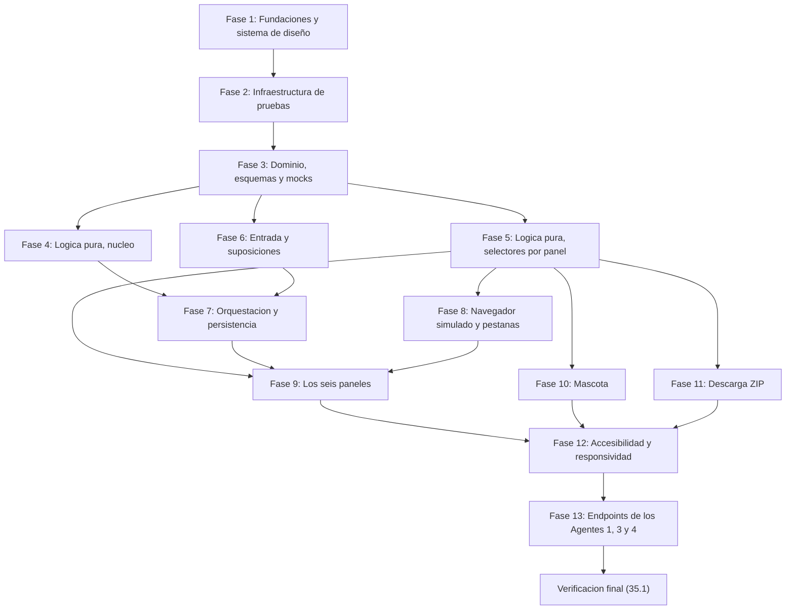

# Implementation Plan: frontend-ui

## Overview

Plan de implementación en TypeScript (Next.js 15 App Router, React 19) del frontend completo de KiroSpec Studio y de los tres endpoints HTTP que faltan. El orden respeta la petición explícita: **primero el frontend contra datos simulados y, al final, los endpoints HTTP de los Agentes 1, 3 y 4**.

Punto de partida verificado: `npx tsc --noEmit` limpio, `npx vitest run` con 125 pruebas verdes y `npx next build` correcto listando `ƒ /api/generate-spec`. Ese estado debe seguir verde después de cada tarea.

Se reutiliza sin reescribir: `src/domain/{types,schemas,errors}.ts`, `src/application/generate-{architecture,devsecops}-spec.ts`, `src/infrastructure/llm/*`, `src/infrastructure/writers/{kiro-file-writer,agent4-file-writer}.ts`, `src/infrastructure/mocks/{mock-loader,agent4-mock-loader}.ts`, `src/prompts/*`, `src/index.ts` y `src/app/api/generate-spec/route.ts`.

Consecuencia del orden elegido: durante las Fases 1 a 12 solo existe `POST /api/generate-spec`. Las llamadas del Orquestador_UI a `/api/generate-market`, `/api/generate-compliance` y `/api/generate-devsecops` responden 404, y el Adaptador_Datos degrada esas Secciones a `no_disponible` con motivo `fallo_del_agente`. Eso es exactamente el comportamiento que autorizan el Requirement 16 criterio 5 y la suposición 17, así que el frontend se construye y se prueba entero antes de que exista un solo endpoint nuevo.

Convención de pruebas de propiedad: fast-check con `numRuns` mínimo 100 y una etiqueta por prueba con el formato `// Feature: frontend-ui, Property N: {texto de la propiedad}`. Una sola prueba por propiedad de diseño; las propiedades que aplican a dos paneles se implementan como función parametrizada invocada dos veces dentro de la misma prueba.

## Tasks

## Fase 1 — Fundaciones y sistema de diseño

- [x] 1. Sistema de diseño y documento raíz
  - [x] 1.1 Crear los tokens de estilo globales
    - Crear `src/app/globals.css` con variables CSS de color de texto, fondo y acento que satisfagan 4.5:1 en texto normal y 3:1 en texto grande y límites de componente, tokens de tipografía y espaciado, indicador de foco visible con contraste mínimo 3:1 aplicado a `:focus-visible`, tokens de los cuatro niveles de la escala de regulaciones y de los tres de severidad (color más forma), bloque `@media (prefers-reduced-motion: reduce)` que suprime desplazamiento, escalado y parpadeo, y los puntos de corte 480 px, 768 px y 1024 px como custom properties
    - Documentar en comentarios del propio archivo el par de colores de cada token y su relación de contraste calculada
    - _Requirements: 18.2, 18.3, 18.5_

  - [x] 1.2 Reemplazar el documento raíz y el placeholder de la página
    - Modificar `src/app/layout.tsx`: `lang="es"`, importar `globals.css`, `metadata` con título por defecto, enlace "Saltar al contenido principal" como primer elemento tabulable que se hace visible al recibir foco y apunta al punto de referencia `main`, y los puntos de referencia `header`, `nav` y `main`
    - Reemplazar `src/app/page.tsx` (hoy un único `h1` placeholder) por un Server Component que renderiza el punto de referencia `main` con un único encabezado de primer nivel; el montaje de `<AppShell/>` llega en la tarea 15.6
    - Crear `src/app/layout.module.css` y `src/app/page.module.css`
    - _Requirements: 18.6, 18.9_

## Fase 2 — Infraestructura de pruebas

- [x] 2. Habilitar pruebas de componente antes de escribir el primer componente
  - [x] 2.1 Instalar y configurar el entorno de pruebas con DOM
    - Instalar como dependencias de desarrollo con versión fija: `jsdom@^26.0.0`, `@testing-library/react@^16.3.0`, `@testing-library/user-event@^14.6.0`, `@vitejs/plugin-react@^4.4.0`, `axe-core@^4.10.0`
    - Crear `vitest.workspace.ts` con dos proyectos: `node` (patrón `src/{domain,application,infrastructure}/**/*.test.ts` y `src/app/api/**/*.test.ts`) y `jsdom` (patrón `src/app/_components/**/*.test.tsx` y `src/app/_hooks/**/*.test.tsx`, con `@vitejs/plugin-react` y `environment: "jsdom"`)
    - Crear `src/__tests__/setup-jsdom.ts` con `@testing-library/react` cleanup automático y stubs de `matchMedia` y `navigator.clipboard`
    - Añadir a `package.json` los scripts `test:node` y `test:dom`, dejando `test` como la corrida completa del workspace
    - Volver a ejecutar `npx vitest run` y confirmar que las 125 pruebas existentes siguen verdes en el proyecto `node`
    - _Requirements: 1.6, 5.4, 9.12, 18.8, 18.11_

  - [ ]* 2.2 Prueba de humo del entorno de pruebas
    - Crear `src/__tests__/entorno.smoke.test.tsx`: renderizar un componente trivial, consultar por rol y nombre accesible, disparar una pulsación de tecla con `user-event` y ejecutar `axe.run` sobre el árbol
    - _Requirements: 18.11_

## Fase 3 — Modelo de dominio y esquemas nuevos

- [x] 3. Tipos y esquemas Zod que hoy no existen
  - [x] 3.1 Crear el modelo de vista del dominio
    - Crear `src/domain/view-model.ts` con `IdSeccion`, `FuenteSeccion`, `MotivoNoDisponible`, la unión discriminada `Seccion<T>`, `Reporte` (brief con forma `Agent1Output` más las seis Secciones), `EstadoGeneracion`, `EstadoUI`, `Suposicion`, `EntradaFormulario` y los tipos `VistaMercado`, `VistaTecnico`, `VistaCostos`, `VistaCompliance`, `VistaTareas` y `VistaDevSecOps`
    - Declarar la constante de orden canónico de Secciones y el mapa `FuenteSeccion → IdSeccion[]` (`agente1 → [mercado]`, `agente2 → [tecnico, costos, tareas]`, `agente3 → [compliance]`, `agente4 → [devsecops]`)
    - _Requirements: 7.17, 16.3, 16.4_

  - [x] 3.2 Crear el contrato del informe de mercado del Agente 1
    - Crear `src/domain/market-report.ts` con los tipos del informe y `src/domain/market-report-schemas.ts` con el esquema Zod derivado de `shared/schemas/market-report-schema.json` (personas con marca de primaria, problema, propuesta de valor, TAM/SAM/SOM con valor y tipo de fuente, competidores directos, riesgos con categoría y severidad)
    - _Requirements: 21.9, 16.2_

  - [x] 3.3 Crear el contrato del reporte de compliance del Agente 3
    - Crear `src/domain/compliance-report.ts` y `src/domain/compliance-report-schemas.ts` con el esquema Zod derivado del esquema JSON declarado en `COMPLIANCE_SYSTEM_PROMPT` (nivel de riesgo general, categorías de datos, regulaciones con nivel, nombre y justificación, lista de verificación agrupada por categoría)
    - _Requirements: 21.9_

  - [x] 3.4 Crear los esquemas de petición de los cuatro endpoints
    - Crear `src/domain/api-contracts.ts` con `MarketRequestSchema`, `SpecRequestSchema`, `ComplianceRequestSchema` y `DevSecOpsRequestSchema`, reutilizando `Agent1OutputSchema` y `TechSteeringSchema` de `src/domain/schemas.ts` y dejando opcionales todos los campos derivados de otros agentes en el contrato del Agente 4
    - _Requirements: 21.2_

  - [ ]* 3.5 Pruebas unitarias de los esquemas nuevos
    - Crear `src/domain/market-report-schemas.test.ts`, `src/domain/compliance-report-schemas.test.ts` y `src/domain/api-contracts.test.ts`: un ejemplo válido y varios inválidos por esquema, y confirmación de que los campos adicionales se descartan sin invalidar
    - _Requirements: 21.9, 16.2_

- [x] 4. Archivos mock faltantes, loaders de servidor y generadores de pruebas
  - [x] 4.1 Añadir el mock del informe de mercado y su loader
    - Crear `.kiro/mocks/agent1.market-report.mock.json` con un informe de mercado completo y válido (el `agent1.mock.json` existente es un brief de entrada, no un informe, y no se toca)
    - Crear `src/infrastructure/mocks/market-report-mock-loader.ts` que lee ese archivo con `fs` en el servidor y lo valida con `MarketReportSchema`, devolviendo un error de dominio controlado si falta o no valida
    - _Requirements: 16.1, 16.5, 16.10, 21.7_

  - [x] 4.2 Añadir el mock del reporte de compliance y su loader
    - Crear `.kiro/mocks/agent3.mock.json` con un reporte de compliance completo y válido
    - Crear `src/infrastructure/mocks/compliance-mock-loader.ts` con el mismo patrón de lectura en servidor y validación Zod
    - _Requirements: 16.1, 16.5, 16.10, 21.7_

  - [ ]* 4.3 Pruebas unitarias de los loaders de mock
    - Crear `src/infrastructure/mocks/market-report-mock-loader.test.ts` y `src/infrastructure/mocks/compliance-mock-loader.test.ts`: archivo presente y válido, archivo ausente, archivo con JSON corrupto y archivo que no cumple el esquema
    - _Requirements: 16.10, 21.7_

  - [x] 4.4 Crear los generadores fast-check compartidos
    - Crear `src/__tests__/generators/` con `arb-reporte.ts` (las 3^6 combinaciones de Estado_Sección), `arb-market-report.ts` (TAM/SAM/SOM como cadenas arbitrarias, listas vacías, campos ausentes), `arb-agent2-output.ts`, `arb-compliance-report.ts`, `arb-agent4-output.ts` (artefactos ausentes, vacíos, gigantes y con marcado HTML), `arb-grafo-tareas.ts` (acíclico, cíclico, con identificadores desconocidos y duplicados), `arb-texto-idea.ts` (emojis, acentos, caracteres combinantes, solo espacios) y `arb-estado-ui.ts`
    - _Requirements: 16.11, 7.18_

## Fase 4 — Lógica pura de vista: núcleo (sin React)

- [x] 5. Máquina de estados de la generación
  - [x] 5.1 Implementar el reducer de generación
    - Crear `src/application/view/generation-reducer.ts` con el estado inicial, el catálogo de acciones (inicio, resolución por Fuente_Sección, fallo con motivo, tiempo límite, cancelación, reintento), la función total `derivarEstadoGeneracion` que recalcula el Estado_Generación a partir de los seis Estado_Sección, y el descarte silencioso de acciones que no correspondan a una transición admitida
    - Resolver una Fuente_Sección debe alterar únicamente las Secciones de esa fuente y no tocar el contenido de las Secciones ya `disponible`
    - _Requirements: 6.1, 6.3, 6.5, 6.7, 6.13, 6.14, 7.17_
    - _Properties: 5, 6_

  - [x] 5.2 Implementar reintento dirigido, tope de intentos y cancelación en el reducer
    - Extender `src/application/view/generation-reducer.ts` con el contador de intentos por Fuente_Sección (0..3), el reintento que devuelve a `pendiente` exactamente las Secciones de esa fuente, el bloqueo del reintento al alcanzar 3 intentos por entrada, el reinicio de contadores al iniciar una generación nueva y la cancelación que conserva las Secciones `disponible` sin producir mensaje de error
    - _Requirements: 6.9, 6.10, 6.11, 7.7, 7.8, 7.9, 7.10_
    - _Properties: 7_

  - [ ]* 5.3 Prueba de propiedad de las transiciones de Estado_Generación
    - **Property 5: Totalidad, unicidad y validez de las transiciones de Estado_Generación**
    - Crear `src/application/view/generation-reducer.property.test.ts` con la etiqueta `// Feature: frontend-ui, Property 5: ...`
    - **Validates: Requirements 6.7, 6.13, 6.14, 7.17**

  - [ ]* 5.4 Prueba de propiedad de aislamiento entre Fuente_Sección
    - **Property 6: Aislamiento entre Fuente_Sección**
    - Permutaciones de resoluciones, tiempos límite, cancelaciones y errores; verificar el conteo exacto de Secciones `disponible` sobre seis
    - Etiqueta `// Feature: frontend-ui, Property 6: ...`
    - **Validates: Requirements 6.2, 6.3, 6.5, 6.6, 6.11, 7.10, 7.16**

  - [ ]* 5.5 Prueba de propiedad del reintento dirigido con tope de tres
    - **Property 7: Reintento dirigido con tope de tres intentos**
    - Etiqueta `// Feature: frontend-ui, Property 7: ...`
    - **Validates: Requirements 6.9, 6.10, 7.7, 7.8, 7.9, 7.10**

- [x] 6. Adaptador de datos y códec del Almacén_Sesión
  - [x] 6.1 Implementar el Adaptador_Datos
    - Crear `src/application/view/report-adapter.ts`: validación Zod por Sección descartando campos no declarados, normalización (recorte de extremos, colapso de espacios internos, conversión de cadenas numéricas finitas, sin inventar valores por defecto), derivación de Técnico, Costos y Tareas desde una sola `Agent2Output` con fallo independiente por Sección, mapeo de fallos a los cuatro motivos y diagnóstico que registra solo identificador de Sección y ruta del campo fallido
    - Ninguna ruta debe lanzar excepciones
    - _Requirements: 7.13, 7.14, 16.2, 16.3, 16.4, 16.8, 16.9, 16.11, 16.12_
    - _Properties: 9, 10_

  - [ ]* 6.2 Prueba de propiedad de totalidad del Adaptador_Datos
    - **Property 9: Totalidad del Adaptador_Datos**
    - Crear `src/application/view/report-adapter.property.test.ts` con `numRuns` elevado y la etiqueta `// Feature: frontend-ui, Property 9: ...`
    - **Validates: Requirements 7.13, 16.5, 16.10, 16.11**

  - [ ]* 6.3 Prueba de propiedad de idempotencia de la normalización
    - **Property 10: Idempotencia de la normalización**
    - Etiqueta `// Feature: frontend-ui, Property 10: ...`
    - **Validates: Requirements 16.12**

  - [x] 6.4 Implementar el códec versionado del Almacén_Sesión
    - Crear `src/application/view/session-codec.ts`: serialización del conjunto declarado de entradas (versión de esquema, entrada, Suposiciones, Reporte con Estado_Sección, Pestaña_Activa, preferencia de mascota, contadores de reintento), exclusión del contenido de Secciones `pendiente` y `no_disponible`, y lectura que descarta por completo el contenido ante versión distinta, esquema inválido o JSON truncado
    - _Requirements: 7.1, 17.1, 17.2, 17.5, 17.7, 17.10_
    - _Properties: 34, 35_

  - [ ]* 6.5 Prueba de propiedad de ida y vuelta del Almacén_Sesión
    - **Property 34: Ida y vuelta de serialización del Almacén_Sesión**
    - Crear `src/application/view/session-codec.property.test.ts` con la etiqueta `// Feature: frontend-ui, Property 34: ...`
    - **Validates: Requirements 7.1, 17.1, 17.2, 17.7**

  - [ ]* 6.6 Prueba de propiedad de robustez de lectura del Almacén_Sesión
    - **Property 35: Robustez de lectura del Almacén_Sesión**
    - Contenido válido, truncado, corrupto, de versión desconocida y con cualquier combinación de Estado_Sección
    - Etiqueta `// Feature: frontend-ui, Property 35: ...`
    - **Validates: Requirements 17.5, 17.10**

- [~] 7. Checkpoint — asegurar que todas las pruebas pasan
  - Ejecutar `npx tsc --noEmit` y `npx vitest run`; preguntar al usuario si surgen dudas.

## Fase 5 — Lógica pura de vista: selectores por panel

- [x] 8. Selectores de mercado y de costos
  - [x] 8.1 Implementar la normalización del nombre del proyecto
    - Crear `src/application/view/selectors/url-slug.ts`: minúsculas, reemplazo de cada carácter acentuado por su letra base, descarte de todo lo que no sea `a`–`z`, `0`–`9` o guion, truncado a 40 caracteres, y el caso de nombre vacío que produce la URL sin segmento y el nombre de ZIP `kirospec-reporte.zip`
    - _Requirements: 8.1, 8.3, 8.4_
    - _Properties: 33_

  - [ ]* 8.2 Prueba de propiedad de la normalización del nombre
    - **Property 33: Normalización del nombre en la URL y en el ZIP**
    - Crear `src/application/view/selectors/url-slug.property.test.ts` con la etiqueta `// Feature: frontend-ui, Property 33: ...`
    - **Validates: Requirements 8.1, 8.3, 8.4**

  - [x] 8.3 Implementar los cálculos de la vista de mercado
    - Crear `src/application/view/selectors/market-view.ts`: persona primaria con respaldo a la primera persona, extracción de magnitud de TAM/SAM/SOM conservando el texto entregado sin reformatear, decisión de barras contra lista de texto, anchos acotados a 0–100 %, texto alternativo con nombre, valor y base, cotas de 8 competidores, 10 características del MVP y 3 riesgos con su conteo de omitidos, y etiquetas en español de categoría y severidad
    - _Requirements: 10.1, 10.2, 10.5, 10.7, 10.8, 10.9, 10.10, 10.11, 10.12, 10.13, 10.14, 10.16, 10.17_
    - _Properties: 16, 17, 18_

  - [x] 8.4 Implementar los cálculos de la vista de costos
    - Crear `src/application/view/selectors/cost-view.ts`: total por escenario como suma de montos redondeados a dos decimales excluyendo los no finitos, barras proporcionales acotadas con 0 % cuando el máximo es cero o no finito, unión de servicios emparejados por nombre en el orden MVP y luego los exclusivos de Escala sin duplicar, columna Diferencia con signo explícito, guion largo en la igualdad y `$0 (free)` en montos cero, y cota de 50 filas con conteo de omitidos
    - _Requirements: 12.2, 12.4, 12.5, 12.6, 12.7, 12.8, 12.9, 12.10, 12.11, 12.14_
    - _Properties: 16, 20, 21, 22_

  - [ ]* 8.5 Prueba de propiedad del acotamiento de las barras
    - **Property 16: Acotamiento de las barras proporcionales**
    - Función de propiedad parametrizada por generador, invocada una vez con magnitudes de mercado y una vez con totales de costos, dentro de la misma prueba
    - Crear `src/application/view/selectors/bar-width.property.test.ts` con la etiqueta `// Feature: frontend-ui, Property 16: ...`
    - **Validates: Requirements 10.7, 10.8, 10.9, 10.10, 12.4, 12.5**

  - [ ]* 8.6 Prueba de propiedad de preservación de TAM, SAM y SOM
    - **Property 17: Preservación de TAM, SAM y SOM**
    - Crear `src/application/view/selectors/market-view.property.test.ts` con la etiqueta `// Feature: frontend-ui, Property 17: ...`
    - **Validates: Requirements 10.5, 10.6, 10.11, 10.12**

  - [ ]* 8.7 Prueba de propiedad de consistencia de los totales de costo
    - **Property 20: Consistencia de los totales de costo**
    - Crear `src/application/view/selectors/cost-view.property.test.ts` con la etiqueta `// Feature: frontend-ui, Property 20: ...`
    - **Validates: Requirements 12.2, 12.11, 12.14**

  - [ ]* 8.8 Prueba de propiedad de la aritmética de la columna Diferencia
    - **Property 21: Aritmética de la columna Diferencia**
    - Etiqueta `// Feature: frontend-ui, Property 21: ...`
    - **Validates: Requirements 12.8, 12.9, 12.10**

  - [ ]* 8.9 Prueba de propiedad del emparejamiento de servicios
    - **Property 22: Emparejamiento de servicios entre escenarios**
    - Etiqueta `// Feature: frontend-ui, Property 22: ...`
    - **Validates: Requirements 12.6, 12.7**

- [x] 9. Selectores de tareas, compliance, diagrama y DevSecOps
  - [x] 9.1 Implementar el cálculo de niveles de tarea
    - Crear `src/application/view/selectors/task-view.ts`: profundidad topológica con nivel 1 para las tareas sin dependencias existentes, dependencias inexistentes ignoradas y marcadas, detección de ciclos con agrupación final, marcado de identificadores duplicados, primera tarea ejecutable, y cotas de 300 tareas y 20 niveles con conteo de omitidos
    - _Requirements: 14.1, 14.2, 14.3, 14.5, 14.6, 14.7, 14.8, 14.9, 14.10, 14.13, 14.14_
    - _Properties: 23, 24_

  - [ ]* 9.2 Prueba de propiedad del orden topológico
    - **Property 23: Orden topológico de los niveles de tarea**
    - Crear `src/application/view/selectors/task-view.property.test.ts` con la etiqueta `// Feature: frontend-ui, Property 23: ...`
    - **Validates: Requirements 14.2, 14.3, 14.14**

  - [ ]* 9.3 Prueba de propiedad de robustez del grafo de tareas
    - **Property 24: Robustez del grafo de tareas**
    - Grafos con ciclos, dependencias desconocidas, identificadores duplicados y lista vacía
    - Etiqueta `// Feature: frontend-ui, Property 24: ...`
    - **Validates: Requirements 14.1, 14.5, 14.6, 14.7, 14.8, 14.9, 14.13**

  - [x] 9.4 Implementar la agrupación de compliance
    - Crear `src/application/view/selectors/compliance-view.ts`: agrupación de regulaciones por nivel en el orden obligatorio, requiere verificación, recomendado y no aplica, con los niveles no reconocidos al final y orden entregado dentro de cada nivel; nombre y justificación verbatim; traducción de rótulos de categoría conocidos y verbatim para los desconocidos; omisión de los grupos sin entradas; y cotas de 20 categorías de datos y 10 grupos de verificación con conteo de omitidos
    - _Requirements: 13.2, 13.7, 13.8, 13.9, 13.10, 13.12_
    - _Properties: 18, 25_

  - [ ]* 9.5 Prueba de propiedad del orden y fidelidad de las regulaciones
    - **Property 25: Orden y fidelidad de las regulaciones**
    - Crear `src/application/view/selectors/compliance-view.property.test.ts` con la etiqueta `// Feature: frontend-ui, Property 25: ...`
    - **Validates: Requirements 13.7, 13.8, 13.10, 13.12**

  - [x] 9.6 Implementar el análisis del texto Mermaid
    - Crear `src/application/view/selectors/mermaid-view.ts`: conteo de nodos previo al renderizado con corte por encima de 40, clasificación del campo de diagrama en ausente, no Mermaid o candidato a renderizar, y texto alternativo que enumera hasta 40 servicios y 80 conexiones en la forma origen → destino
    - _Requirements: 11.2, 11.3, 11.6, 11.8_
    - _Properties: 28_

  - [ ]* 9.7 Prueba de propiedad del texto alternativo del diagrama
    - **Property 28: Texto alternativo del diagrama**
    - Crear `src/application/view/selectors/mermaid-view.property.test.ts` con la etiqueta `// Feature: frontend-ui, Property 28: ...`
    - **Validates: Requirements 11.6**

  - [x] 9.8 Implementar la vista de DevSecOps y el truncado compartido
    - Crear `src/application/view/selectors/devsecops-view.ts`: los cinco artefactos emparejados con sus rutas destino literales en el orden declarado, conteo de artefactos presentes y no vacíos sobre cinco, texto visible truncado a 20 000 caracteres carácter a carácter sin normalizar, y texto completo separado para el portapapeles
    - Crear `src/application/view/selectors/truncate-text.ts` con la función de truncado visible que marca con puntos suspensivos solo cuando hubo recorte y devuelve el texto completo por separado, usada por los límites de 160, 80, 300, 200, 120 y 20 000 caracteres
    - _Requirements: 20.2, 20.3, 20.5, 20.12, 13.6, 14.4, 11.4, 11.5, 10.5_
    - _Properties: 18, 26, 29_

  - [ ]* 9.9 Prueba de propiedad del truncado visible con texto completo accesible
    - **Property 26: Truncado visible con texto completo accesible**
    - Crear `src/application/view/selectors/truncate-text.property.test.ts` con la etiqueta `// Feature: frontend-ui, Property 26: ...`
    - **Validates: Requirements 10.5, 11.4, 11.5, 13.6, 14.4, 20.5**

  - [ ]* 9.10 Prueba de propiedad de las cotas de lista con conteo de omitidos
    - **Property 18: Cotas de lista con conteo de omitidos**
    - Función parametrizada invocada sobre las cotas de 8, 10, 3, 30, 15, 20, 10, 300 y 20 elementos de los selectores ya implementados
    - Crear `src/application/view/selectors/list-caps.property.test.ts` con la etiqueta `// Feature: frontend-ui, Property 18: ...`
    - **Validates: Requirements 10.13, 10.14, 10.17, 11.1, 11.4, 11.5, 13.2, 13.9, 14.10**

- [~] 10. Checkpoint — asegurar que todas las pruebas pasan
  - Ejecutar `npx tsc --noEmit` y `npx vitest run`; preguntar al usuario si surgen dudas.

## Fase 6 — Pantallas de entrada y de suposiciones

- [x] 11. Modelo puro del formulario de entrada
  - [x] 11.1 Implementar la lógica de entrada sin React
    - Crear `src/application/view/input-model.ts` (misma regla de la decisión D9: lógica probable fuera de React): longitud útil como cantidad de puntos de código tras recortar extremos, reglas de validación con sus tres mensajes literales, corte a 2000 caracteres en escritura y pegado, conservación de la Idea y de los campos comunes al alternar de modo, retención y restauración de los campos exclusivos de Modo_Experto, e invariantes del Selector_Región (exclusividad de Global, máximo cinco regiones específicas, orden canónico, quitar una opción, colapso a una sola opción en Modo_Rápido)
    - _Requirements: 1.3, 1.4, 1.8, 2.4, 3.3, 3.4, 3.5, 3.7, 3.8, 4.4, 4.8_
    - _Properties: 1, 2, 3_

  - [ ]* 11.2 Prueba de propiedad de longitud útil y no invocación con entrada inválida
    - **Property 1: Longitud útil y no invocación con entrada inválida**
    - Usar `arb-texto-idea.ts` (emojis, acentos, caracteres combinantes, solo espacios)
    - Crear `src/application/view/input-model.property.test.ts` con la etiqueta `// Feature: frontend-ui, Property 1: ...`
    - **Validates: Requirements 4.1, 4.7, 4.8, 4.10**

  - [ ]* 11.3 Prueba de propiedad de preservación de la entrada al alternar de modo
    - **Property 2: Preservación de la entrada al alternar de modo**
    - Etiqueta `// Feature: frontend-ui, Property 2: ...`
    - **Validates: Requirements 1.3, 1.4, 1.9**

  - [ ]* 11.4 Prueba de propiedad de los invariantes del Selector_Región
    - **Property 3: Invariantes del Selector_Región**
    - Etiqueta `// Feature: frontend-ui, Property 3: ...`
    - **Validates: Requirements 1.8, 3.3, 3.4, 3.5, 3.7, 3.8**

- [x] 12. Componentes de la Pantalla de Entrada
  - [x] 12.1 Implementar el Selector_Modo
    - Crear `src/app/_components/entrada/selector-modo.tsx` y su módulo CSS: `role="radiogroup"` con etiqueta accesible, dos `role="radio"` con `aria-checked`, una única parada de tabulación, activación con Enter y Barra conservando el foco, rótulos "Modo Rápido / Solo escribe tu idea" y "Modo Experto / Brief completo", y deshabilitado con `aria-disabled="true"` durante la generación
    - _Requirements: 1.1, 1.2, 1.5, 1.6, 1.7, 1.9_

  - [x] 12.2 Implementar el Formulario_Entrada y el contador de caracteres
    - Crear `src/app/_components/entrada/formulario-entrada.tsx` y `src/app/_components/entrada/contador-caracteres.tsx` con sus módulos CSS: área de texto de la Idea con encabezado, texto de ejemplo, alto inicial de 4 líneas y crecimiento hasta 12 con desplazamiento posterior; siete campos visibles en Modo_Experto con sus límites; errores con `role="alert"`, `aria-describedby` y `aria-invalid`; reevaluación en cada cambio; envío deshabilitado durante la generación; contador permanente de caracteres restantes
    - _Requirements: 2.1, 2.7, 3.1, 3.2, 3.6, 4.2, 4.3, 4.4, 4.5, 4.6, 4.7, 4.9_

  - [x] 12.3 Implementar el Selector_Región
    - Crear `src/app/_components/entrada/selector-region.tsx` y su módulo CSS: selección simple de cinco opciones en Modo_Rápido, múltiple de seis en Modo_Experto sobre `input-model.ts`, chips en orden canónico con control de quitar y nombre accesible por opción, atributos ARIA de selección múltiple, y nota informativa debajo del selector
    - _Requirements: 2.4, 3.3, 3.4, 3.5, 3.6, 3.7, 3.8, 3.9_

  - [x] 12.4 Implementar la sección de detalles opcionales
    - Crear `src/app/_components/entrada/detalles-opcionales.tsx` y su módulo CSS: colapsable con `aria-expanded` y `aria-controls`, conservación de valores al colapsar, contador de campos con valor incluido en el nombre accesible, y expansión automática cuando la restauración aporta al menos un valor
    - _Requirements: 2.2, 2.3, 2.5, 2.6, 2.8, 2.9_

  - [ ]* 12.5 Pruebas de componente de la Pantalla de Entrada
    - Crear `src/app/_components/entrada/*.test.tsx`: Enter y Barra en el Selector_Modo, una sola parada de tabulación, expansión y colapso de detalles opcionales, mensajes de error literales con sus atributos ARIA, corte a 2000 caracteres por pegado, chips en orden canónico y exclusividad de Global, y controles deshabilitados durante la generación
    - _Requirements: 1.6, 1.7, 2.2, 2.3, 2.6, 3.9, 4.2, 4.3, 4.5, 4.7_

- [x] 13. Panel de suposiciones
  - [x] 13.1 Implementar el modelo puro de las Suposiciones
    - Crear `src/application/view/assumptions-model.ts`: hasta 12 filas en orden estable, edición limitada a 120 caracteres, descarte del texto no confirmado, restauración al valor inferido con retiro de la marca de modificada, rechazo del valor vacío o de solo espacios conservando el valor previo, y composición del brief confirmado con el valor actual de cada Suposición
    - _Requirements: 5.1, 5.6, 5.7, 5.10, 5.11_
    - _Properties: 4_

  - [ ]* 13.2 Prueba de propiedad de invariancia estructural del Panel_Suposiciones
    - **Property 4: Invariancia estructural del Panel_Suposiciones**
    - Crear `src/application/view/assumptions-model.property.test.ts` con la etiqueta `// Feature: frontend-ui, Property 4: ...`
    - **Validates: Requirements 5.1, 5.6, 5.10, 5.11**

  - [x] 13.3 Implementar el Panel_Suposiciones
    - Crear `src/app/_components/suposiciones/panel-suposiciones.tsx` y `src/app/_components/suposiciones/fila-suposicion.tsx` con sus módulos CSS: tabla de filas en modo lectura con controles "Cambiar" y "Restaurar" con nombre accesible derivado de la etiqueta, edición en línea con foco automático y confirmación deshabilitada mientras una fila edita, Escape que descarta y devuelve el foco, error de valor vacío con `aria-describedby` y `aria-invalid`, omisión del panel en Modo_Experto o sin Suposiciones
    - _Requirements: 5.2, 5.3, 5.4, 5.5, 5.8, 5.9, 5.10_

  - [ ]* 13.4 Pruebas de componente del Panel_Suposiciones
    - Crear `src/app/_components/suposiciones/panel-suposiciones.test.tsx`: edición en línea, Escape, confirmación con valor en blanco, "Restaurar", devolución del foco al control "Cambiar" y deshabilitado del control de confirmación
    - _Requirements: 5.3, 5.4, 5.5, 5.9, 5.10_

- [~] 14. Checkpoint — asegurar que todas las pruebas pasan
  - Ejecutar `npx tsc --noEmit` y `npx vitest run`; preguntar al usuario si surgen dudas.

## Fase 7 — Orquestación incremental y persistencia

Los cuatro `fetch` se emiten contra las cuatro rutas del mismo origen. Mientras los endpoints de los Agentes 1, 3 y 4 no existan (Fase 13), sus respuestas 404 degradan sus Secciones a `no_disponible` con motivo `fallo_del_agente`, comportamiento autorizado por el Requirement 16 criterio 5 y la suposición 17. Las pruebas de esta fase sustituyen `fetch` por un doble controlado.

- [ ] 15. Orquestador_UI, anuncios y persistencia
  - [~] 15.1 Implementar el hook del Orquestador_UI
    - Crear `src/app/_hooks/use-generacion.ts`: `GeneracionProvider` sobre `useReducer` con el reducer de la tarea 5.1, cuatro solicitudes emitidas en el mismo tick, un `AbortController` por Fuente_Sección, tiempo límite por fuente con `AbortSignal.any([controller.signal, AbortSignal.timeout(120_000)])`, publicación de cada resultado en su propio `then`/`catch` a través del Adaptador_Datos, distinción entre aborto por cancelación y aborto por tiempo límite, y reintento dirigido por fuente
    - _Requirements: 4.1, 4.7, 6.1, 6.3, 6.6, 6.9, 6.11, 7.7, 7.8, 7.9, 7.15, 7.16_

  - [~] 15.2 Implementar la cadencia de los anuncios accesibles
    - Crear `src/app/_hooks/use-anuncios-aria.ts` y `src/app/_components/comunes/region-anuncios.tsx`: región `aria-live="polite"` compartida, intervalo mínimo de 5 segundos entre anuncios, agrupación de las llegadas dentro de ese intervalo en un solo anuncio y anuncio inmediato de los estados terminales
    - _Requirements: 6.12, 15.14, 18.8_
    - _Properties: 8_

  - [ ]* 15.3 Prueba de propiedad de la cadencia de los anuncios
    - **Property 8: Cadencia mínima de los anuncios en regiones aria-live**
    - Crear `src/app/_hooks/use-anuncios-aria.property.test.ts` con temporizadores simulados y la etiqueta `// Feature: frontend-ui, Property 8: ...`
    - **Validates: Requirements 6.12, 15.14**

  - [~] 15.4 Implementar el hook del Almacén_Sesión
    - Crear `src/app/_hooks/use-almacen-sesion.ts` sobre `session-codec.ts`: escritura diferida que no bloquea más de 50 ms, escritura al enviar el formulario y al pasar cada Sección a `disponible`, reemisión de las solicitudes de las Secciones restauradas como `pendiente`, limpieza selectiva al cancelar o volver a la entrada, degradación silenciosa con aviso no bloqueante cuando `sessionStorage` falla o excede cuota
    - _Requirements: 17.1, 17.2, 17.3, 17.4, 17.6, 17.8, 17.9_

  - [ ]* 15.5 Pruebas de los hooks con red y almacenamiento simulados
    - Crear `src/app/_hooks/use-generacion.test.tsx` y `src/app/_hooks/use-almacen-sesion.test.tsx`: cuatro solicitudes concurrentes por envío válido, ninguna solicitud con entrada inválida, aislamiento entre fuentes, 404 de las rutas aún inexistentes que degrada a `fallo_del_agente`, tiempo límite que solo afecta a su fuente, cancelación sin mensaje de error, tope de tres reintentos y restauración tras recarga
    - _Requirements: 4.1, 4.10, 6.6, 6.11, 7.10, 7.15, 16.5, 17.3, 17.4, 17.8_

  - [~] 15.6 Montar el armazón de la aplicación y la pantalla de generación
    - Crear `src/app/_components/app-shell.tsx`, `src/app/_components/generacion/pantalla-generacion.tsx` y `src/app/_components/generacion/indicador-progreso.tsx` con sus módulos CSS: Client Component raíz que selecciona la pantalla activa, monta el `GeneracionProvider` y la región de anuncios, traslada el foco al encabezado de primer nivel de la pantalla destino, indicador de progreso derivado del Estado_Sección real con el formato «N de 6», control de cancelación habilitado, permanencia en la pantalla de generación mientras las seis Secciones están `pendiente`, apertura de la Pantalla de Salida con la primera Sección `disponible`, estado de error con reintento cuando las seis quedan `no_disponible` y el mensaje "La generación tardó demasiado. Intenta de nuevo."
    - Modificar `src/app/page.tsx` para montar `<AppShell/>` dentro del punto de referencia `main`
    - _Requirements: 6.2, 6.4, 6.8, 7.11, 7.12, 18.6, 18.8_

  - [ ]* 15.7 Pruebas de componente del armazón y del progreso
    - Crear `src/app/_components/app-shell.test.tsx` y `src/app/_components/generacion/pantalla-generacion.test.tsx`: traslado de foco entre pantallas, texto «N de 6» coherente con el estado, control de cancelación operable con teclado y mensajes de agotamiento de reintentos
    - _Requirements: 6.2, 6.8, 6.10, 7.11, 7.12, 18.8_

- [~] 16. Checkpoint — asegurar que todas las pruebas pasan
  - Ejecutar `npx tsc --noEmit` y `npx vitest run`; preguntar al usuario si surgen dudas.

## Fase 8 — Navegador simulado y navegación por pestañas

- [ ] 17. Navegador simulado
  - [~] 17.1 Implementar el marco del Navegador_Simulado
    - Crear `src/app/_components/salida/navegador-simulado.tsx` y su módulo CSS: barra superior con controles decorativos atrás, adelante y recargar fuera del orden de tabulación y marcados como decorativos, URL simulada `kiro-spec-studio.app/resultados/<nombre-normalizado>` como texto seleccionable y copiable sin comportamiento de enlace, omisión del segmento cuando el nombre normalizado queda vacío, y ranura derecha para el Descargador_ZIP
    - _Requirements: 8.1, 8.2, 8.3_

  - [ ]* 17.2 Pruebas de componente del Navegador_Simulado
    - Crear `src/app/_components/salida/navegador-simulado.test.tsx`: controles decorativos no alcanzables con Tab, URL sin destino navegable y URL sin segmento con nombre vacío
    - _Requirements: 8.1, 8.2, 8.3_

- [ ] 18. Navegación por pestañas
  - [~] 18.1 Implementar la lógica pura de las Pestañas
    - Crear `src/application/view/selectors/tab-view.ts`: resolución de la Pestaña_Activa inicial con precedencia de la restaurada válida y respaldo a la primera Sección `disponible` en el orden canónico, desplazamiento cíclico por flechas, Inicio y Fin sobre las seis Pestañas, y marcas textuales "generando" y "no disponible" por Estado_Sección
    - _Requirements: 7.2, 7.3, 7.4, 9.2, 9.3, 9.4, 9.6, 9.13, 9.14, 9.15_
    - _Properties: 14, 15_

  - [ ]* 18.2 Prueba de propiedad de totalidad y unicidad de la Pestaña_Activa
    - **Property 14: Totalidad y unicidad de la Pestaña_Activa**
    - Crear `src/application/view/selectors/tab-view.property.test.ts` con la etiqueta `// Feature: frontend-ui, Property 14: ...`
    - **Validates: Requirements 9.6, 9.9, 9.10, 9.11, 9.13, 9.14, 9.15**

  - [ ]* 18.3 Prueba de propiedad de resolución de la Pestaña_Activa inicial
    - **Property 15: Resolución de la Pestaña_Activa inicial**
    - Etiqueta `// Feature: frontend-ui, Property 15: ...`
    - **Validates: Requirements 7.4, 9.2, 9.3, 9.4**

  - [~] 18.4 Implementar el Navegador_Pestañas
    - Crear `src/app/_components/salida/navegador-pestanas.tsx` y su módulo CSS: seis Pestañas con los rótulos literales en orden, roles `tablist`/`tab`/`tabpanel` con `aria-orientation`, `aria-selected`, `aria-controls` y `aria-labelledby`, una sola parada de tabulación con `tabindex` 0/-1, Tab que mueve el foco al Panel activo, flechas cíclicas e Inicio/Fin incluyendo Pestañas `pendiente` y `no_disponible`, distinción de la activa por subrayado y color simultáneos, marcador de carga en Secciones `pendiente`, motivo de máximo 200 caracteres y control de reintento en Secciones `no_disponible`, y carril desplazable en móvil que centra la Pestaña_Activa
    - _Requirements: 7.2, 7.3, 7.5, 7.6, 9.1, 9.5, 9.7, 9.8, 9.9, 9.10, 9.11, 9.12, 9.13, 9.14, 19.2_

  - [ ]* 18.5 Pruebas de componente del teclado en las Pestañas
    - Crear `src/app/_components/salida/navegador-pestanas.test.tsx`: flechas cíclicas, Inicio y Fin, Tab hacia el Panel activo, atributos ARIA de las seis Pestañas, marcas textuales "generando" y "no disponible" y desplazamiento del carril al cambiar la activa
    - _Requirements: 7.2, 7.3, 9.9, 9.10, 9.11, 9.12, 9.13, 9.14, 19.2_

## Fase 9 — Los seis paneles

- [ ] 19. Componentes comunes de los paneles
  - [~] 19.1 Implementar los componentes comunes
    - Crear `src/app/_components/comunes/indicador-semaforo.tsx`, `src/app/_components/comunes/marcador-ausente.tsx` y `src/app/_components/comunes/region-desplazable.tsx` con sus módulos CSS: semáforo con etiqueta textual y forma además del color sobre las dos escalas declaradas y nivel neutro para valores desconocidos, marcador con el texto literal "No disponible", y región con desplazamiento contenido alcanzable por Tab cuando desborda, operable con flechas y expuesta como región con nombre accesible
    - _Requirements: 10.16, 10.18, 13.1, 13.5, 13.16, 16.8, 16.9, 18.4, 19.5, 19.6, 20.14_
    - _Properties: 13, 19_

  - [ ]* 19.2 Prueba de propiedad de totalidad y degradación del Indicador_Semáforo
    - **Property 19: Totalidad y degradación del Indicador_Semáforo**
    - Crear `src/app/_components/comunes/indicador-semaforo.property.test.tsx` con la etiqueta `// Feature: frontend-ui, Property 19: ...`
    - **Validates: Requirements 10.16, 10.18, 13.1, 13.5, 13.16, 18.4**

  - [ ]* 19.3 Prueba de propiedad de degradación al Marcador_Ausente
    - **Property 13: Degradación al Marcador_Ausente**
    - Campos ausentes, nulos y de tipo incompatible, y valores numéricos no finitos o fuera del rango 0–999 999 999 999
    - Crear `src/app/_components/comunes/marcador-ausente.property.test.tsx` con la etiqueta `// Feature: frontend-ui, Property 13: ...`
    - **Validates: Requirements 16.8, 16.9**

- [ ] 20. Panel_Mercado
  - [~] 20.1 Implementar el Panel_Mercado
    - Crear `src/app/_components/salida/panel-mercado.tsx` y su módulo CSS sobre `market-view.ts`: encabezado con nombre del proyecto y audiencia derivada de la persona primaria separada por «·», bloques PROBLEMA y PROPUESTA DE VALOR, TAM/SAM/SOM con barras o lista de texto y su texto alternativo, tabla de hasta 8 competidores con conteo de omitidos, características del MVP numeradas desde el brief confirmado, y tres riesgos con Indicador_Semáforo
    - _Requirements: 10.1, 10.2, 10.3, 10.4, 10.5, 10.6, 10.7, 10.9, 10.10, 10.12, 10.13, 10.14, 10.16_

  - [ ]* 20.2 Pruebas unitarias de los estados vacíos del Panel_Mercado
    - Crear `src/app/_components/salida/panel-mercado.test.tsx`: los mensajes literales "No se identificaron competidores directos", "No se identificaron riesgos relevantes", "No hay características del MVP declaradas" y el mensaje de ausencia de estimación de tamaño de mercado
    - _Requirements: 10.10, 10.15, 10.19, 10.20, 10.21_

- [ ] 21. Panel_Técnico y diagrama de infraestructura
  - [~] 21.1 Instalar Mermaid e implementar el componente de diagrama
    - Instalar `mermaid@^11.6.0` como dependencia de producción
    - Crear `src/app/_components/salida/diagrama-mermaid.tsx` y su módulo CSS: import dinámico `await import("mermaid")` dentro de un Client Component, inicialización con `startOnLoad: false`, `securityLevel: "strict"` y `htmlLabels: false`, conteo de nodos previo con aborto por encima de 40, presupuesto de 3 s con `Promise.race`, degradación al bloque preformateado con el mensaje "No pudimos dibujar el diagrama" y hasta 20 000 caracteres, mensaje de diagrama ausente, contenedor desplazable en ambos ejes y texto alternativo en las dos salidas
    - _Requirements: 11.2, 11.3, 11.6, 11.8, 11.10_
    - _Properties: 27_

  - [ ]* 21.2 Prueba de propiedad de robustez del diagrama
    - **Property 27: Robustez del diagrama de infraestructura**
    - Campo ausente, nulo, vacío, solo espacios, sintaxis inválida, formato distinto de Mermaid, más de 40 nodos y hasta 100 000 caracteres; exactamente una de las tres salidas y ninguna excepción
    - Crear `src/app/_components/salida/diagrama-mermaid.property.test.tsx` con la etiqueta `// Feature: frontend-ui, Property 27: ...`
    - **Validates: Requirements 11.2, 11.3, 11.8, 11.10**

  - [~] 21.3 Implementar el Panel_Técnico
    - Crear `src/app/_components/salida/panel-tecnico.tsx` y su módulo CSS: encabezado con patrón y hasta 8 tecnologías separadas por «·», rótulo "DIAGRAMA DE INFRAESTRUCTURA" con el componente de diagrama, tabla IAM de hasta 30 filas con acciones y recurso truncados a 200 caracteres y efecto, y lista "DECISIONES CLAVE" de hasta 15 entradas de 300 caracteres derivadas del patrón, los límites SOLID y las guardas de seguridad
    - _Requirements: 11.1, 11.4, 11.5, 11.7, 11.9_

  - [ ]* 21.4 Prueba de integración del renderizado real de Mermaid
    - Crear `src/app/_components/salida/diagrama-mermaid.integracion.test.tsx`: uno o dos ejemplos de texto Mermaid válido que se renderizan gráficamente, y un ejemplo inválido que degrada al bloque preformateado
    - _Requirements: 11.2, 11.3_

- [ ] 22. Panel_Costos
  - [~] 22.1 Implementar el Panel_Costos
    - Crear `src/app/_components/salida/panel-costos.tsx` y su módulo CSS sobre `cost-view.ts`: escenarios MVP y Escala con usuarios mensuales del brief confirmado y costo en USD con dos decimales, barras proporcionales decorativas con su porcentaje en texto, tabla de desglose con las columnas Servicio, MVP/mes, Escala/mes y Diferencia, fila TOTAL consistente, y aviso con enlace a la calculadora de AWS con `target="_blank"` y `rel="noopener noreferrer"`
    - _Requirements: 12.1, 12.3, 12.4, 12.5, 12.6, 12.7, 12.12_

  - [ ]* 22.2 Pruebas unitarias del Panel_Costos
    - Crear `src/app/_components/salida/panel-costos.test.tsx`: mensaje "El Reporte no incluye desglose de costos" con ocultamiento de la fila TOTAL, atributos del enlace externo y celdas `$0 (free)` y guion largo
    - _Requirements: 12.9, 12.10, 12.12, 12.13_

- [ ] 23. Panel_Compliance
  - [~] 23.1 Implementar el Panel_Compliance
    - Crear `src/app/_components/salida/panel-compliance.tsx` y su módulo CSS sobre `compliance-view.ts`: encabezado con nivel de riesgo en escala de severidad, cuadrícula "DATOS QUE MANEJA LA APP" sin controles ni elementos enfocables, leyenda de los cuatro niveles, regulaciones agrupadas por nivel con nombre y justificación verbatim y truncado accesible, lista de verificación de solo lectura con marcadores estáticos, y avisos legales
    - _Requirements: 13.1, 13.2, 13.3, 13.5, 13.6, 13.7, 13.8, 13.9, 13.10, 13.11, 13.13_

  - [ ]* 23.2 Pruebas unitarias del Panel_Compliance
    - Crear `src/app/_components/salida/panel-compliance.test.tsx`: mensajes "El Reporte no declara categorías de datos", "El Reporte no incluye regulaciones aplicables" con omisión de la leyenda y "El Reporte no incluye lista de verificación" conservando el aviso legal, y ausencia de casillas marcables
    - _Requirements: 13.3, 13.4, 13.11, 13.14, 13.15_

- [ ] 24. Panel_Tareas
  - [~] 24.1 Implementar el Panel_Tareas
    - Crear `src/app/_components/salida/panel-tareas.tsx` y su módulo CSS sobre `task-view.ts`: encabezado con total de tareas y primera tarea ejecutable, grupos "Nivel N" en orden ascendente, marca "← siguiente", dependencias inexistentes marcadas, grupo final "Dependencias circulares" con su aviso, marca de identificador duplicado, conteo de tareas y niveles omitidos, y contenido de solo lectura
    - _Requirements: 14.1, 14.3, 14.4, 14.5, 14.6, 14.7, 14.8, 14.9, 14.10, 14.11_

  - [ ]* 24.2 Pruebas unitarias del Panel_Tareas
    - Crear `src/app/_components/salida/panel-tareas.test.tsx`: mensaje "El Reporte no incluye tareas" con omisión de encabezados de nivel, marca "← siguiente" en la primera tarea de nivel 1 y Marcador_Ausente cuando ninguna tarea alcanza el nivel 1
    - _Requirements: 14.5, 14.6, 14.12_

- [ ] 25. Panel_DevSecOps
  - [~] 25.1 Implementar el Panel_DevSecOps
    - Crear `src/app/_components/salida/panel-devsecops.tsx` y su módulo CSS sobre `devsecops-view.ts`: encabezado con nombre del proyecto y conteo sobre cinco, cinco bloques rotulados con sus rutas destino literales usadas como nombre accesible, contenido en `<pre>` dentro de `RegionDesplazable` preservando espacios e indentación, nota de truncado a 20 000 caracteres, control "Copiar" con el texto completo y confirmación por `aria-live`, manejo del rechazo del portapapeles, y prohibición de `dangerouslySetInnerHTML`
    - _Requirements: 20.1, 20.2, 20.3, 20.4, 20.5, 20.6, 20.7, 20.8, 20.9, 20.10, 20.11, 20.12, 20.13, 20.14_

  - [ ]* 25.2 Prueba de propiedad de fidelidad del contenido de los artefactos
    - **Property 29: Fidelidad del contenido de los Artefacto_DevSecOps**
    - Crear `src/app/_components/salida/panel-devsecops.fidelidad.property.test.tsx` con la etiqueta `// Feature: frontend-ui, Property 29: ...`
    - **Validates: Requirements 20.4, 20.7, 20.16**

  - [ ]* 25.3 Prueba de propiedad del escapado del contenido no confiable
    - **Property 30: Escapado del contenido no confiable**
    - Contenido con etiquetas HTML, atributos de evento, entidades y fragmentos de script; el contenido debe aparecer solo como nodos de texto
    - Crear `src/app/_components/salida/panel-devsecops.escapado.property.test.tsx` con la etiqueta `// Feature: frontend-ui, Property 30: ...`
    - **Validates: Requirements 20.11**

  - [ ]* 25.4 Prueba de propiedad de robustez del Panel_DevSecOps
    - **Property 31: Robustez del Panel_DevSecOps**
    - Crear `src/app/_components/salida/panel-devsecops.robustez.property.test.tsx` con la etiqueta `// Feature: frontend-ui, Property 31: ...`
    - **Validates: Requirements 20.1, 20.9, 20.12, 20.15**

  - [ ]* 25.5 Pruebas de componente del control "Copiar"
    - Crear `src/app/_components/salida/panel-devsecops.test.tsx`: copia exitosa con anuncio, rechazo del portapapeles con mensaje y control aún habilitado, omisión del control en artefactos ausentes y mensaje "El Reporte no incluye artefactos de DevSecOps"
    - _Requirements: 20.6, 20.7, 20.8, 20.12, 20.13_

- [ ] 26. Integración de los paneles en la Pantalla de Salida
  - [~] 26.1 Cablear los seis paneles y los límites de error
    - Crear `src/app/_components/salida/pantalla-salida.tsx` y `src/app/_components/comunes/limite-error-panel.tsx` con sus módulos CSS: composición del Navegador_Simulado, el Navegador_Pestañas y los seis paneles, un Error Boundary por panel cuyo estado de fallo se presenta como Sección `no_disponible` con motivo `fallo_del_agente`, exclusión del contenido de las Secciones `no_disponible` del renderizado y de lo persistido, y actualización del panel activo sin mover el foco cuando su Sección pasa a `disponible`
    - _Requirements: 7.1, 7.2, 7.3, 7.5, 7.6, 9.5, 16.7_

  - [ ]* 26.2 Prueba de propiedad de robustez del renderizado ante fallos parciales
    - **Property 12: Robustez del renderizado ante fallos parciales**
    - Las 3^6 combinaciones de Estado_Sección con `arb-reporte.ts`, incluidas las seis `pendiente` y las seis `no_disponible`
    - Crear `src/app/_components/salida/pantalla-salida.robustez.property.test.tsx` con la etiqueta `// Feature: frontend-ui, Property 12: ...`
    - **Validates: Requirements 7.2, 7.3, 7.18, 16.7**

  - [ ]* 26.3 Prueba de propiedad de equivalencia entre Fuente_Datos
    - **Property 11: Equivalencia entre Fuente_Datos y descarte de campos adicionales**
    - Pares de respuestas con distinto orden de claves y campos adicionales arbitrarios que deben producir el mismo árbol renderizado, sin indicador de Fuente_Datos
    - Crear `src/app/_components/salida/pantalla-salida.equivalencia.property.test.tsx` con la etiqueta `// Feature: frontend-ui, Property 11: ...`
    - **Validates: Requirements 16.2, 16.6**

- [~] 27. Checkpoint — asegurar que todas las pruebas pasan
  - Ejecutar `npx tsc --noEmit` y `npx vitest run`; preguntar al usuario si surgen dudas.

## Fase 10 — Mascota Kiro

- [ ] 28. Mascota_Kiro y sus mensajes
  - [~] 28.1 Implementar el catálogo de mensajes de la mascota
    - Crear `src/application/view/selectors/mascot-messages.ts`: exactamente un mensaje no vacío de 120 caracteres o menos por Estado_Mascota, derivación del Estado_Mascota desde la primera Sección `pendiente` en el orden canónico con la correspondencia declarada, mensajes por Pestaña_Activa en estado `completado`, mensaje para Pestaña con Sección `no_disponible`, sustitución de marcadores como `[nicho]` y `[región]` por su valor con variante genérica cuando el dato falta, y el mensaje literal "Algo salió mal, intentemos de nuevo"
    - _Requirements: 15.2, 15.3, 15.4, 15.5, 15.8, 15.9, 15.10, 15.11, 15.16, 15.17, 15.18_
    - _Properties: 36, 37_

  - [ ]* 28.2 Prueba de propiedad de totalidad y unicidad de los mensajes
    - **Property 36: Totalidad, unicidad y no vacuidad de los mensajes de la Mascota_Kiro**
    - Crear `src/application/view/selectors/mascot-messages.property.test.ts` con la etiqueta `// Feature: frontend-ui, Property 36: ...`
    - **Validates: Requirements 15.2, 15.10, 15.11, 15.16, 15.17, 15.18**

  - [ ]* 28.3 Prueba de propiedad del avance derivado del progreso real
    - **Property 37: Estado_Mascota derivado del progreso real**
    - Incluye el mínimo de 2000 ms de exhibición por mensaje con temporizadores simulados
    - Etiqueta `// Feature: frontend-ui, Property 37: ...`
    - **Validates: Requirements 15.4, 15.5, 15.6, 15.7**

  - [~] 28.4 Implementar el componente de la Mascota_Kiro
    - Crear `src/app/_components/mascota/mascota-kiro.tsx` y su módulo CSS: posición fija inferior derecha con la altura y separaciones declaradas, globo de diálogo con `aria-live="polite"` disponible incluso mientras la mascota está oculta, transición de 150–300 ms al cambiar de Pestaña, variante sin desplazamiento ni bucle bajo `prefers-reduced-motion`, controles de ocultar y mostrar operables con teclado con la preferencia persistida en el Almacén_Sesión, límites de tamaño en viewport angosto y reserva de espacio en viewport bajo
    - _Requirements: 15.1, 15.12, 15.13, 15.14, 15.15, 19.8, 19.9_

  - [ ]* 28.5 Pruebas de componente de la Mascota_Kiro
    - Crear `src/app/_components/mascota/mascota-kiro.test.tsx`: ocultar y mostrar con teclado, persistencia de la preferencia tras recarga simulada, presencia de la región `aria-live` mientras está oculta y ausencia de desplazamiento con `prefers-reduced-motion` activo
    - _Requirements: 15.13, 15.14, 15.15_

## Fase 11 — Descarga del reporte en ZIP

- [ ] 29. Descargador_ZIP
  - [~] 29.1 Instalar fflate e implementar la composición del ZIP
    - Instalar `fflate@0.8.2` como dependencia de producción
    - Crear `src/application/view/selectors/zip-content.ts`: un archivo por Sección `disponible` distinta de DevSecOps nombrado con el identificador de la Sección y la extensión entregada, un archivo por Artefacto_DevSecOps presente y no vacío en su ruta destino, ningún archivo por Sección no disponible, y nombre de archivo no vacío de 64 caracteres o menos sobre `url-slug.ts`
    - Crear `src/app/_hooks/use-descarga-zip.ts`: import dinámico `await import("fflate")`, generación en el cliente sin solicitudes de red, presupuesto de 5 s y corte a 10 s con cancelación de la preparación
    - _Requirements: 8.4, 8.5, 8.9, 8.10_
    - _Properties: 32_

  - [ ]* 29.2 Prueba de propiedad del contenido y del nombre del ZIP
    - **Property 32: Completitud del contenido del ZIP y validez de su nombre**
    - Crear `src/application/view/selectors/zip-content.property.test.ts` con la etiqueta `// Feature: frontend-ui, Property 32: ...`
    - **Validates: Requirements 8.4, 8.5, 8.10**

  - [~] 29.3 Implementar el control de descarga
    - Crear `src/app/_components/salida/descargador-zip.tsx` y su módulo CSS: confirmación que enumera por nombre las Secciones que quedarán fuera con generación solo al confirmar, deshabilitado sin Secciones disponibles con motivo accesible, deshabilitado con indicador de progreso mientras prepara descartando activaciones adicionales, y mensaje de error con rehabilitación cuando falla o excede 10 s
    - Montar el control en la ranura derecha del `NavegadorSimulado`
    - _Requirements: 8.6, 8.7, 8.8, 8.9_

  - [ ]* 29.4 Pruebas de componente del Descargador_ZIP
    - Crear `src/app/_components/salida/descargador-zip.test.tsx`: confirmación aceptada y cancelada, deshabilitado sin Secciones, una sola descarga por activación y mensaje de error tras el corte de 10 s
    - _Requirements: 8.6, 8.7, 8.8, 8.9_

## Fase 12 — Accesibilidad y responsividad

- [ ] 30. Accesibilidad verificable y layout responsivo
  - [~] 30.1 Implementar el layout responsivo
    - Modificar los módulos CSS de los componentes y `src/app/globals.css`: apilado del Navegador_Simulado y de los bloques de Mercado y Costos por debajo de 768 px, carril de Pestañas con desplazamiento propio, contención del desplazamiento horizontal en tablas, diagrama y bloques preformateados, cuadrícula de Compliance y lista de Tareas en una columna, y áreas objetivo mínimas de 44 × 44 px con separación de 8 px
    - _Requirements: 19.1, 19.2, 19.3, 19.4, 19.5, 19.7, 19.10, 19.11_

  - [~] 30.2 Añadir la auditoría automatizada de accesibilidad y el checklist manual
    - Crear `src/__tests__/accesibilidad.smoke.test.tsx`: ejecutar `axe-core` sobre la Pantalla de Entrada, el Panel_Suposiciones y la Pantalla de Salida, fallando ante incidencias de nivel AA
    - Crear `docs/manual-accessibility-checklist.md` con los criterios que la verificación automatizada no cubre y que quedan documentados como revisión manual: contraste real medido en navegador, lector de pantalla, zoom al 200 %, espaciado de texto aumentado, `prefers-reduced-motion` real y layout de 320 px a 1920 px
    - _Requirements: 18.11, 18.3, 18.5, 18.10, 19.11_

  - [ ]* 30.3 Prueba de propiedad de accesibilidad estructural
    - **Property 43: Accesibilidad estructural del árbol renderizado**
    - Nombre accesible no vacío que no sea solo un emoji y alcanzable por teclado en cada control, un único encabezado de primer nivel por pantalla sin niveles omitidos, y cada contenedor desplazable expuesto como región con nombre accesible y alcanzable por Tab
    - Crear `src/__tests__/accesibilidad-estructural.property.test.tsx` con la etiqueta `// Feature: frontend-ui, Property 43: ...`
    - **Validates: Requirements 18.1, 18.6, 19.6, 20.14**

- [~] 31. Checkpoint — asegurar que todas las pruebas pasan
  - Ejecutar `npx tsc --noEmit`, `npx vitest run` y `npx next build`; preguntar al usuario si surgen dudas.

## Fase 13 — Endpoints HTTP de los Agentes 1, 3 y 4 (última fase, por decisión explícita)

Hasta aquí el frontend está completo y probado contra datos simulados y contra el único endpoint existente. Esta fase cierra el círculo: endurece el manejador del Agente 2 y añade los tres manejadores que faltan.

- [ ] 32. Writer inerte y endurecimiento del endpoint existente del Agente 2
  - [~] 32.1 Implementar el NoOpFileWriter
    - Crear `src/infrastructure/writers/no-op-file-writer.ts` que implementa `FileWriterPort` y `Agent4FileWriterPort` sin tocar el sistema de archivos, con un registro interno de invocaciones consultable desde las pruebas
    - _Requirements: 21.11_
    - _Properties: 42_

  - [~] 32.2 Endurecer `POST /api/generate-spec`
    - Modificar `src/app/api/generate-spec/route.ts`: validar el cuerpo con `SpecRequestSchema` antes de cualquier otra operación y responder 400 sin invocar al LLM cuando no cumple, sustituir `KiroFileWriter` por `NoOpFileWriter`, eliminar el `as any` del brief, aplicar el tiempo límite del endpoint coherente con los 120 s con respuesta 502, y validar la salida contra `Agent2OutputSchema` antes de responder 200
    - Crear `src/app/api/_shared/error-serializer.ts` que emite únicamente `{ error, category, operation }` más `fieldPath` en errores de validación, descartando `context`, `receivedValue`, `cause`, `stack` y todo fragmento del prompt, y usarlo en el manejador
    - Esta tarea modifica código existente que ya está verde: volver a ejecutar `npx vitest run` y confirmar que las 125 pruebas previas siguen pasando
    - _Requirements: 21.2, 21.3, 21.4, 21.5, 21.6, 21.11, 21.12_
    - _Properties: 41, 42_

  - [ ]* 32.3 Prueba de propiedad de ausencia de escrituras en disco
    - **Property 42: Ausencia de escrituras en disco desde HTTP**
    - Crear `src/app/api/_shared/no-escritura.property.test.ts` que ejercita los cuatro manejadores con el `NoOpFileWriter` instrumentado, con la etiqueta `// Feature: frontend-ui, Property 42: ...`
    - **Validates: Requirements 21.11**

  - [ ]* 32.4 Prueba de propiedad de no filtración de detalles internos
    - **Property 41: No filtración de detalles internos**
    - Respuestas de error de los cuatro endpoints y motivos mostrados en Paneles no disponibles: catálogo previsto, máximo 200 caracteres en los motivos y ausencia de rastros de pila, claves, nombres de variables de entorno, fragmentos de prompt, texto de la Idea y valores de Suposiciones
    - Crear `src/app/api/_shared/error-serializer.property.test.ts` con la etiqueta `// Feature: frontend-ui, Property 41: ...`
    - **Validates: Requirements 7.5, 7.14, 21.5, 21.8**

- [ ] 33. Casos de uso de los Agentes 1 y 3
  - [~] 33.1 Implementar `GenerateMarketReportUseCase`
    - Crear `src/application/generate-market-report.ts` siguiendo el patrón de `generate-architecture-spec.ts`: validación de entrada, invocación del `LlmPort` con `PM_MARKET_SYSTEM_PROMPT` de `src/prompts/`, validación de la salida con `MarketReportSchema`, resolución por mock a través de `market-report-mock-loader.ts` y errores de la jerarquía tipada existente
    - _Requirements: 21.7, 21.9_

  - [~] 33.2 Implementar `GenerateComplianceReportUseCase`
    - Crear `src/application/generate-compliance-report.ts` con el mismo patrón sobre `COMPLIANCE_SYSTEM_PROMPT`, validando la salida con `ComplianceReportSchema` y resolviendo por mock con `compliance-mock-loader.ts`
    - _Requirements: 21.7, 21.9_

  - [ ]* 33.3 Pruebas unitarias de los casos de uso nuevos
    - Crear `src/application/generate-market-report.test.ts` y `src/application/generate-compliance-report.test.ts` con `LlmPort` espiado: éxito, salida que no cumple el esquema, error transitorio, error permanente y modo mock
    - _Requirements: 21.6, 21.7, 21.9_

- [ ] 34. Manejadores HTTP nuevos
  - [~] 34.1 Crear `POST /api/generate-market`
    - Crear `src/app/api/generate-market/route.ts`: validación con `MarketRequestSchema`, composición de `GenerateMarketReportUseCase` con `NoOpFileWriter`, resolución por mock leída en el servidor, tiempo límite del endpoint con 502, validación de salida antes del 200, serializador de error compartido y respuesta 500 con mensaje genérico cuando falta la credencial fuera de modo mock
    - _Requirements: 21.1, 21.2, 21.3, 21.4, 21.5, 21.6, 21.7, 21.8, 21.11, 21.12_

  - [~] 34.2 Crear `POST /api/generate-compliance`
    - Crear `src/app/api/generate-compliance/route.ts` con el mismo contrato sobre `ComplianceRequestSchema` y `GenerateComplianceReportUseCase`
    - _Requirements: 21.1, 21.2, 21.3, 21.4, 21.5, 21.6, 21.7, 21.8, 21.11, 21.12_

  - [~] 34.3 Crear `POST /api/generate-devsecops`
    - Crear `src/app/api/generate-devsecops/route.ts`: validación con `DevSecOpsRequestSchema` de cuerpo parcial, reutilización de `GenerateDevSecOpsSpecUseCase` sin duplicar su lógica, relleno de los campos ausentes desde `.kiro/mocks/agent4.mock.json` en el servidor con `agent4-mock-loader.ts`, `NoOpFileWriter`, validación de salida con `Agent4OutputSchema` y la misma taxonomía de estados
    - _Requirements: 21.1, 21.2, 21.3, 21.4, 21.5, 21.6, 21.7, 21.8, 21.10, 21.11, 21.12_

  - [ ]* 34.4 Prueba de propiedad de totalidad de la respuesta de los endpoints
    - **Property 38: Totalidad de la respuesta de los endpoints**
    - Cuerpos válidos y arbitrarios contra los cuatro manejadores con `LlmPort` que devuelve éxito, error transitorio, error permanente y excepción inesperada
    - Crear `src/app/api/_shared/totalidad-respuesta.property.test.ts` con la etiqueta `// Feature: frontend-ui, Property 38: ...`
    - **Validates: Requirements 21.4, 21.13**

  - [ ]* 34.5 Prueba de propiedad de conformidad de contrato de las respuestas 200
    - **Property 39: Conformidad de contrato de las respuestas 200**
    - Crear `src/app/api/_shared/conformidad-200.property.test.ts` con la etiqueta `// Feature: frontend-ui, Property 39: ...`
    - **Validates: Requirements 21.6, 21.9, 21.14**

  - [ ]* 34.6 Prueba de propiedad de rechazo temprano sin invocar al LLM
    - **Property 40: Rechazo temprano sin invocar al LLM**
    - Crear `src/app/api/_shared/rechazo-temprano.property.test.ts` con la etiqueta `// Feature: frontend-ui, Property 40: ...`
    - **Validates: Requirements 21.2, 21.3**

  - [ ]* 34.7 Pruebas de integración de los cuatro endpoints
    - Crear `src/app/api/generate-market/route.test.ts`, `src/app/api/generate-compliance/route.test.ts`, `src/app/api/generate-devsecops/route.test.ts` y `src/app/api/generate-spec/route.test.ts`: invocar `POST` con un `Request` real cubriendo 200, 400, 502 y 500, modo mock sin invocación al LLM y credencial ausente
    - _Requirements: 21.4, 21.7, 21.8, 21.13_

- [ ] 35. Verificación final
  - [~] 35.1 Verificar el proyecto completo
    - Ejecutar `npx tsc --noEmit`, `npx vitest run` (proyectos `node` y `jsdom`) y `npx next build`
    - Confirmar en la salida del build que aparecen las cuatro rutas: `ƒ /api/generate-spec`, `ƒ /api/generate-market`, `ƒ /api/generate-compliance` y `ƒ /api/generate-devsecops`
    - Ejecutar `npm run lint` y corregir lo que reporte
    - _Requirements: 21.1_

## Notes

- Las tareas marcadas con `*` son opcionales y pueden omitirse para un MVP más rápido; son las pruebas unitarias, de propiedad, de componente y de integración.
- El frontend se construye y se prueba entero contra datos simulados en las Fases 1 a 12; los endpoints de los Agentes 1, 3 y 4 llegan en la Fase 13 por decisión explícita del usuario. Durante ese periodo las Secciones Mercado, Compliance y DevSecOps se degradan a `no_disponible` con motivo `fallo_del_agente`, lo que autorizan el Requirement 16 criterio 5 y la suposición 17.
- Cada prueba de propiedad usa fast-check con `numRuns` mínimo 100 y lleva la etiqueta `// Feature: frontend-ui, Property N: {texto}`. Una sola prueba por propiedad de diseño; las que aplican a dos paneles se parametrizan por generador dentro de la misma prueba.
- La lógica pura vive en `src/application/view/` sin importar React; los efectos viven en `src/app/_hooks/`; los componentes en `src/app/_components/`. Ningún módulo de `domain/` o `application/` importa React.
- La conformidad plena con WCAG 2.1 AA no es automatizable: la tarea 30.2 automatiza lo que `axe-core` cubre y documenta el resto como checklist de revisión manual en el repositorio.

## Task Dependency Graph



Lectura del grafo: las Fases 1, 2 y 3 son estrictamente secuenciales porque nada se puede probar sin el entorno de pruebas y nada se puede tipar sin el modelo de vista. Una vez cerrada la Fase 3, las Fases 4, 5 y 6 avanzan en paralelo (reducer y adaptador, selectores de panel, y modelo de entrada son módulos independientes). La Fase 7 necesita el núcleo de la Fase 4 y las pantallas de la Fase 6. Las Fases 8, 10 y 11 dependen solo de los selectores de la Fase 5 y pueden avanzar en paralelo entre sí; la Fase 9 necesita además el armazón de la Fase 7 y las Pestañas de la Fase 8. La Fase 12 cierra sobre todo lo renderizable y la Fase 13 va al final por decisión explícita.

```json
{
  "waves": [
    { "id": 0, "tasks": ["1.1", "1.2"] },
    { "id": 1, "tasks": ["2.1"] },
    { "id": 2, "tasks": ["2.2", "3.1", "3.2", "3.3", "3.4"] },
    { "id": 3, "tasks": ["3.5", "4.1", "4.2"] },
    { "id": 4, "tasks": ["4.3", "4.4"] },
    { "id": 5, "tasks": ["5.1", "6.1", "6.4", "8.1", "8.3", "8.4", "9.1", "9.4", "9.6", "9.8", "11.1", "13.1", "18.1"] },
    { "id": 6, "tasks": ["5.2", "6.2", "6.3", "6.5", "6.6", "8.2", "8.5", "8.6", "8.7", "8.8", "8.9", "9.2", "9.3", "9.5", "9.7", "9.9", "9.10", "11.2", "11.3", "11.4", "13.2", "18.2", "18.3"] },
    { "id": 7, "tasks": ["5.3", "5.4", "5.5"] },
    { "id": 8, "tasks": ["12.1", "12.2", "12.3", "12.4", "13.3", "17.1", "18.4", "19.1", "21.1", "28.1"] },
    { "id": 9, "tasks": ["12.5", "13.4", "17.2", "18.5", "19.2", "19.3", "20.1", "21.2", "21.3", "22.1", "23.1", "24.1", "25.1", "28.2", "28.3", "28.4"] },
    { "id": 10, "tasks": ["15.1", "15.2", "15.4", "20.2", "21.4", "22.2", "23.2", "24.2", "25.2", "25.3", "25.4", "25.5", "28.5", "29.1"] },
    { "id": 11, "tasks": ["15.3", "15.5", "15.6", "26.1", "29.3"] },
    { "id": 12, "tasks": ["15.7", "26.2", "26.3", "29.2", "29.4", "30.1"] },
    { "id": 13, "tasks": ["30.2", "30.3", "32.1"] },
    { "id": 14, "tasks": ["32.2", "33.1", "33.2"] },
    { "id": 15, "tasks": ["32.3", "32.4", "33.3", "34.1", "34.2", "34.3"] },
    { "id": 16, "tasks": ["34.4", "34.5", "34.6", "34.7"] },
    { "id": 17, "tasks": ["35.1"] }
  ]
}
```
